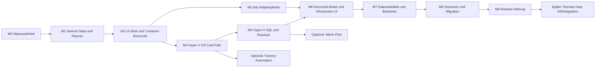

# SQL Server Lab – konsolidierter Entwicklungs- und Ausführungsplan

| Merkmal | Wert |
|---|---|
| Projekt | `gecompat/SQL_Server_Lab` |
| Status | `ACTIVE_EXECUTION_BACKLOG` |
| Stand | 2026-08-24 |
| Ausgangsstand | Planungsabgleich gegen `origin/main`, Known Limitations, offene Regressionen und den lokalen sowie CI-gestützten Validierungsbericht vom 2026-08-20; Commit-IDs sind kein Planungsvertrag |
| Ziel | eine einzige ausführbare Lieferreihenfolge für Core, UI, Adapter, Hyper-V, Datenartefakte, Qualität und spätere Erweiterungen |
| Runtime-Nachweis | ausschließlich Code, passende Tests, [KNOWN_LIMITATIONS.md](../Quality/KNOWN_LIMITATIONS.md) und datierte Validierungsnachweise |

## 1. Zweck und Geltung

Dieser Plan konsolidiert die vorhandenen Master-, Architektur-, UI-,
Zero-Touch-, Adapter-, Qualitäts- und Backlog-Dokumente zu einer umsetzbaren
Entwicklungsreihenfolge. Er ersetzt keine bindende Architekturentscheidung,
sondern legt fest, **in welcher Reihenfolge** die offenen Ziele geliefert und
abgenommen werden.

Die vom Auftrag verwendete Bezeichnung `Codex_LAB` wird in diesem Dokument als
Arbeitskontext verstanden. Der tatsächliche Repository- und Produktname bleibt
`SQL_Server_Lab`.

### 1.1 Quellen und Vorrang

Bei Widersprüchen gilt folgende Reihenfolge:

1. [SQL-Server-zentrierte Scope-Entscheidung](../Architecture/SQL_SERVER_CENTRIC_SCOPE_DECISION.md) und [verbindliche Masterplan-Ergänzung](MASTER_IMPLEMENTATION_PLAN_SCOPE_ADDENDUM.md);
2. Security-, Privacy-, Lizenz-, State-, Ownership- und Cleanup-Verträge;
3. Code, Schemas, Kataloge und tatsächlich ausgeführte Tests als Ist-Nachweis;
4. [Bekannte Grenzen](../Quality/KNOWN_LIMITATIONS.md) als öffentliche Statuswahrheit;
5. bindende Architektur-Zielverträge;
6. dieser Plan für Priorität, Abhängigkeit und Lieferreihenfolge;
7. spezielle Backlogs für ausdrücklich vertagte Funktionen.

Planungsdokumente allein sind kein Runtime-Nachweis. `implemented` bedeutet,
dass Code und statischer Vertrag vorhanden sind. `validated` wird nur nach
einem tatsächlich erfolgreichen, passenden Lauf verwendet.

### 1.2 Verbindlich berücksichtigte Planungsquellen

- [Master-Umsetzungsplan](MASTER_IMPLEMENTATION_PLAN.md) einschließlich Wellenstatus;
- [Masterplan-Ergänzung](MASTER_IMPLEMENTATION_PLAN_SCOPE_ADDENDUM.md);
- [Project-Adapter-Priorisierung](PROJECT_ADAPTER_PRIORITIZATION.md);
- [Zukunftsplan der Menüführung](FUTURE_UI_WORKFLOW_PLAN_2026-08-08.md);
- [Konsolen-, Lifecycle- und Storage-Konsolidierungsplan aus der manuellen Abnahme](CONSOLE_LIFECYCLE_AND_STORAGE_CONSOLIDATION_PLAN_2026-08-12.md);
- [Providerneutraler Batch-, Queue- und Resume-Workflow](PROVIDER_NEUTRAL_BATCH_QUEUE_RESUME_WORKFLOW_2026-08-13.md);
- [Hyper-V-, Image-, Provisionierungs- und Netzwerkvertrag](../Architecture/HYPERV_IMAGE_PROVISIONING_AND_NETWORK_CONTRACT.md);
- [Testdatenbank- und Manifest-Wizard-Vertrag](../Architecture/SAMPLE_DATABASE_PROVISIONING_AND_MANIFEST_WIZARD.md);
- [Vorlagenpool und automatisierte Manifeste](../Architecture/TEMPLATE_POOL_AND_AUTOMATED_MANIFESTS.md);
- [Projektintegrationsvertrag](../Architecture/PROJECT_INTEGRATION_CONTRACT.md);
- [lokale Validierungsstrategie](../Quality/LOCAL_VALIDATION_STRATEGY.md) und [Readiness-Checkliste](../Quality/LOCAL_READINESS_CHECKLIST.md);
- `.ai/PROJECT_CONTEXT.md`, `.ai/WORKING_RULES.md` und `.ai/repo_map.yaml`;
- der interne Zero-Touch-Handover für Hyper-V, insbesondere dessen nicht verhandelbare Anforderungen an unattended Provisionierung, Reconcile, Evaluation-Sicherheit und Cold-Path-Fallback.

## 2. Produktziel und unveränderliche Leitplanken

`SQL_Server_Lab` stellt lokale, isolierte, reproduzierbare und sicher
bereinigbare **SQL-Server-Testumgebungen** bereit. Zusätzliche Komponenten sind
nur zulässig, wenn sie einen dokumentierten SQL-Server-Zweck erfüllen.

Für jede Entwicklungswelle gelten folgende Leitplanken:

1. Docker, Podman und Hyper-V bleiben Kernprovider. Gleichrangigkeit im Zielvertrag bedeutet keine unbewiesene technische Gleichheit.
2. Das Manifest beschreibt den Desired State. UI und CLI sind Ansichten auf denselben Parser-, Planner-, State- und Runtime-Core.
3. Vor jeder Mutation existieren Resource Assessment, Cleanup-Plan, Scope/Owner/Run-ID und ein verständlicher Action Preview.
4. Jede Änderung an einem bestehenden Lab wird als `live`, `restart`, `recreate`, `reprovision` oder `unsupported` klassifiziert.
5. Nach Beginn einer normalen Provisionierung gibt es keine versteckten Benutzereingaben. Factory-, Trust-, Lizenz- und Diagnoseaktionen sind vorher getrennt auszuweisen.
6. Hyper-V-Parent-Images bleiben immutable und hashverifiziert. Normale Runs schreiben nur in Child-/Overlay- und run-lokale Datenträger.
7. Secrets erscheinen weder in Manifest, Lock, Plan, State, VM-Notes, Logs, Evidence noch im Repository.
8. Persistente Daten werden nur nach expliziter Policy behalten. Normales Cleanup entfernt niemals Testdatenbibliothek, Data Root oder Vorlagenpool.
9. Fehlende Capabilities führen zu `UNSUPPORTED`, `NOT_EXECUTED` oder einem expliziten Fallback, niemals zu stiller Simulation.
10. Produktfunktion und lokale Abnahme dürfen nicht von GitHub-hosted Runnern abhängen. Remote-Workflows sind zusätzliche Nachweise, keine Funktionsvoraussetzung.
11. Neue Manifestfelder gelten erst nach Übereinstimmung von Schema, Parser, Runtime, Beispiel, Dokumentation und Test als implementiert.
12. Eine neue öffentliche Funktion benötigt Implementierung, Export, Help, Benutzerreferenz und Test in derselben Welle.
13. `Quick`, `Scenario` und `Custom` sind Bedienansichten auf denselben Core und keine getrennten Lifecycle-Systeme.
14. Ressourcenunterversorgung darf nur bei `RESOURCE_INSUFFICIENT_OVERRIDABLE` bewusst und protokolliert übersteuert werden. Unsichere Pfade, fehlende Capabilities, blockierte Versionen, unzulässige Daten, fehlende Secrets/Lizenzen und ein fehlender Cleanup-Plan bleiben harte Blocker.
15. SQL-Versionen bleiben katalog- und constraintbasiert. `EXPERIMENTAL`, `SUPPORTED`, `DEPRECATED`, `RETIRED` und `BLOCKED` werden ohne Core-Neuentwurf verarbeitet.
16. Der Vorlagenpool überschreibt oder löscht keine Artifacts automatisch. Seine Kapazitäts- und Referenzschutzregeln bleiben erhalten.
17. Der Core wird je Provider mit SQL Server 2025 validiert. Analyze und
    Toolbelt fordern Windows/Linux mit SQL Server 2019, 2022 und 2025 für ihre
    Entwicklungs- und Abnahmematrix an. PerformanceSchulung verwendet
    standardmäßig die aktuelle Linux-Umgebung und weicht nur szenariobezogen ab.

## 3. Verifizierte Ausgangslage

### 3.1 Implementierte Grundlage

| Bereich | Aktueller belastbarer Stand |
|---|---|
| Container-Core | Docker und Podman mit Provisionierung, SQL Readiness, Datenbank, Skript, Restore, Lifecycle und scopegebundenem Cleanup |
| Providerbindung | bestehende Runs verwenden den im State gespeicherten Provider; gemischte Docker-/Podman-Runs besitzen getrennte `ProviderSubRuns` |
| Manifest | Ad-hoc- und unbeaufsichtigter Manifestpfad, externe Secret-Referenzen, Parser, Fachvalidierung und schema-gesteuerter Wizard |
| Datenartefakte | SHA-256, Trust Store, inhaltsadressierter Cache, Quarantäne, Run Lock, direkte `.bak`, sichere ZIP-/7z-Backup-Payload und gepinnte Einzelskripte |
| Samples | Mehrfachauswahl, Output-Kollisionsprüfung und `DATASET_READY`-Verifikation für freigegebene Handler |
| Project Adapter | Vertrag `0.1-draft`, sicherer Resolver, T-SQL-Entrypoints, Capability-/Versions-Gates und synthetischer Beispieladapter |
| Hyper-V-Basis | Generation 2, Secure Boot, Parent-/Child-VHDX, Image Registry, Builder, Zusatz-VHDX, Windows-Specialization, SQL-Readiness-Orchestrierung und scopegebundener Lifecycle |
| UI | interaktives PowerShell-Menü und lokale Loopback-Browseroberfläche mit Workflow-/Job-API |
| Batch und Queue | persistenter Batch-/Operation-Kern, deterministische Expansion, Scheduler, Resume, User-Gates, Console Composer, Batchmanifest und Browserübergabe |
| Qualität | statische Gesamtprüfung, Provider-Smokes, Versions-/Provider-Matrix, Restore-, Mixed-Provider-, Adapter- und Hyper-V-Testpfade |

Am 2026-08-20 wurden die betroffenen statischen Verträge und die reale
Batch-Provider-Matrix erneut ausgeführt:

```text
.\Tests\Static\Invoke-AllChecks.ps1
=> ALLE STATISCHEN VERTRAGSPRUEFUNGEN: PASS
```

Die datierten lokalen und CI-gestützten Ergebnisse für Docker, Podman, Mixed
Provider, Adapter, Batch und Hyper-V stehen in
[VALIDATION_RESULT_2026-08-20.md](../Quality/VALIDATION_RESULT_2026-08-20.md).
Die allgemeine echte Hyper-V-/SQL-2025-Acceptance aus frischer
Installationsmedia bleibt wegen fehlender Eval-ISO blockiert.

### 3.2 Offene Kernlücken

| Lücke | Wirkung |
|---|---|
| der Desired-/Actual-/Diff-/Plan-Vertrag deckt bisher nur read-only Planung und START/STOP ab | weitere Reconcile-Klassen benötigen persistente Verträge und Executor |
| bestehende Hyper-V-Standardwege enthalten noch Factory-/manuelle Übergänge | ein normaler Lablauf ist noch nicht durchgehend Zero-Touch nachgewiesen |
| kein positiver realer Hyper-V-Cold-Path von generalisierter OS-Basis bis SQL `READY` für die Zielmatrix | Mocks und Lifecycle-Smoke beweisen weder OOBE- noch SQL-End-to-End-Bereitschaft |
| Hyper-V-Manifestbindung für Datenbanken, Software, Post-Provisioning und Network Intents ist unvollständig | UI-/Manifestparität fehlt trotz gebundener freier Drives weiterhin |
| Reconcile-Executor und Actual-State-Collector sind auf Lifecycle START/STOP begrenzt | Ressourcen- und Konfigurationsänderungen fehlen |
| drei reale Adapterpiloten fehlen | der Vertrag ist noch nicht an den drei Konsumenten und ihren unterschiedlichen Rollen bewiesen |
| `LAB_GENERATED`-Erzeugung und -Präferenz sind für Single- und Multi-Output-Container-Samples implementiert; Hyper-V-Export ist offen; Script Bundles mit mehreren festen Datenbankoutputs sind implementiert | VM-basierte Baselines benötigen noch Sonderwege |
| Fault-/Scenario-Engine und breite Abbruch-/Recovery-Injektion fehlen | Release-Härtung und komplexe SQL-Szenarien bleiben unvollständig |

### 3.3 Fortlaufend zu prüfende Statusabweichungen

Der CI/CD-Widerspruch ist bereinigt: `.github/workflows` liefern optionale
Remote-Validierung und sind keine Produktabhängigkeit. Als offener UX-Punkt
bleibt:

- die aktuelle Menüposition „Hyper-V-Umgebungen verwalten“ unter der Image-Verwaltung widerspricht dem langfristigen umgebungszentrierten Zielbild.

## 4. Verbindliche Produkt- und UX-Entscheidungen

### 4.1 Kanonischer Bedienpfad

Das künftige Hauptmenü wird nach Benutzeraufgaben gegliedert:

1. **Neue Umgebung erstellen**
2. **Bestehende Umgebung ändern**
3. **Umgebungen verwalten**
4. **Vorlagen und Installationsmedien verwalten**
5. **Erweitert und Diagnose**

Status, Start, Stop, Restart, Datenbanken, Skripte und Remove bleiben erreichbar,
werden jedoch im Bereich der ausgewählten Umgebung gebündelt. Während der
Migration dürfen die heutigen direkten Aktionen als Kompatibilitätsalias
bestehen bleiben.

Die Entscheidung aus dem UI-Entwurf wird damit aufgelöst: Die Verwaltung einer
normalen Umgebung gehört langfristig **nicht** in den Image-Builder-Pfad.
Factory- und Image-Aktionen bleiben getrennt unter Vorlagen/Medien oder
Erweitert. So bleiben der sichere Übergang und das umgebungszentrierte Zielbild
gleichzeitig erhalten.

### 4.2 Gemeinsames Änderungsmodell

```text
Desired State
    -> Preflight und Capability Resolution
    -> Actual State
    -> semantischer Diff
    -> Action Preview mit Änderungsklassen
    -> Bestätigung vor erster Mutation
    -> Operation Journal und Executor
    -> Postconditions
    -> State/Lock aktualisieren
    -> Ergebnis und Recovery-Status
```

Das Action-Preview-Objekt enthält mindestens:

- alte und neue Werte;
- Provider, Run-ID, Instance-ID und betroffene Ressourcenrollen;
- Änderungsklasse je Änderung und höchste Gesamtklasse;
- Downtime und erforderliche Reboots;
- Datenwirkung, Persistenz- und Migrationsweg;
- Trust-, Lizenz-, Exposure- und Sicherheitswarnungen;
- Cleanup-, Rollback- und Recovery-Pfad;
- erwartete Postconditions;
- Kennzeichnung, ob der Ablauf nach Bestätigung vollständig unattended ist.

### 4.3 Standard-, Infrastruktur- und Advanced-Pfad

| Pfad | Inhalt |
|---|---|
| Schnellpfad | Lifecycle, SQL-Status, Datenbank, Sample, Skript, sichere Defaults |
| Infrastruktur | CPU/RAM, Netzwerk, Storage, Persistenz, Reconcile und Downtime |
| Advanced | Host-Folder-Mounts, Factory, manuelle Diagnose, VMConnect, WMI-/Recovery-Werkzeuge |

Host-Folder-Mounts bleiben Spezialkonfiguration. Schreibzugriff benötigt weiter
den doppelten Opt-in im Manifest und im Aufruf. Hyper-V-VHDX und verwaltete
Container-Volumes gehören dagegen in den normalen Storage-Pfad.

## 5. Kritischer Lieferpfad

### 5.1 Aktueller Meilensteinstatus

| Meilenstein | Status am 2026-08-20 | Nächster belastbarer Schritt |
|---|---|---|
| M0 Statuswahrheit | `validated` | Drift weiter statisch verhindern |
| Providerneutraler Instanz-Autostart | `implemented_runtime_partial` | Docker-/SQL-2025-Runtime ist grün; Podman-Self-hosted-Gate und nativen Hyper-V-Lifecycle fortlaufend grün halten |
| M1 Desired State und Planner | `implemented_partial` | Journal/Resume und weitere Änderungsklassen |
| M2 UI und Container-Reconcile | `implemented_partial` | Batch/Queue real verifiziert: Docker und Podman mit je zwei SQL-2025-Runs, Hyper-V mit zwei Windows-2025-Slots, Resume und Cleanup; Prozessabbruch/Manifest-Rerun sowie reale `live`-/`recreate`-Änderungen offen |
| M3 Adapterpiloten | `planned_external_scope` | je ein Pilot in den drei Konsumenten-Repositories |
| M4 Hyper-V OS Cold Path | `implemented_partial` | realer unattended Windows-2025-Cold-Path |
| M5 Hyper-V SQL und Resolver | `implemented_partial` | realer OS-zu-SQL-Cold-Path und Manifestparität |
| M6 Reconcile-Breite | `planned` | Hardware-, Netzwerk-, Storage- und SQL-Änderungsklassen |
| M7 Artifacts und Baselines | `implemented_partial` | Hyper-V-Export/-Nutzung und weitere typisierte Handler |
| M8 Scenarios und Migration | `planned` | Scenario-Vertrag nach den Adapterpiloten |
| M9 Release-Härtung | `implemented_partial` | Failure-Injection und öffentliche Version erst nach Provider-/Adapterabnahme |



Die Reihenfolge hält die dokumentierte Adapterpriorisierung ein. Providerneutrale
Desired-State-, Drive-, Network-, Software- und Reconcile-Verträge werden vor
den Adapterpiloten begonnen; der weitere Hyper-V-Runtimeausbau und die drei
Partnerpiloten können als getrennte Änderungssätze parallel fortschreiten.

## 6. Meilensteine und Arbeitspakete

### 6.1 Priorität, Größenklasse und primäre Verantwortung

Größenklassen sind relative Planungswerte, keine Kalenderzusage. Eine zeitliche
Terminierung erfolgt erst, wenn Verantwortliche, reale Provider-Testfenster und
Arbeiten in den Schwester-Repositories verfügbar sind.

| Meilenstein | Priorität | Größe | Primäre Verantwortung | Harte Abhängigkeit |
|---|---:|---:|---|---|
| M0 Statuswahrheit | P0 | S | Dokumentation/Quality | keine |
| M1 Desired State und Planner | P0 | XL | Core/Contracts | M0 |
| M2 UI und Container-Reconcile | P0 | L | Core, UX, Docker/Podman | M1 |
| M3 Adapterpiloten | P0 | L | Integration plus Konsumenten | M2 und externe Scopes |
| M4 Hyper-V OS Cold Path | P0 | XL | Hyper-V/Windows | M1, reale Baseline |
| M5 Hyper-V SQL und Resolver | P0 | XL | Hyper-V/SQL | M4, verifizierte Medien |
| M6 Reconcile-Breite | P1 | XL | Core, Hyper-V, Netzwerk, UX | M3, M5 |
| M7 Artifacts und Baselines | P1 | L | Artifact/Data/Provider | M5, teilweise M6 |
| M8 Scenarios und Migration | P1 | XL | Scenario/Integration | M3, M6, M7 |
| M9 Release-Härtung | P1 | L | Quality/Release | M8 |

`P0` liefert den sicheren, konsumierbaren Kern. `P1` vervollständigt das
vereinbarte Kernvorhaben. `P2` optimiert oder erweitert nach erfolgreichem
Cold Path. `P3` bleibt entkoppelter Backlog.

### M0 – Statuswahrheit und planbare Baseline

**Ziel:** Alle Front-Door-, Planungs- und Qualitätsquellen beschreiben denselben
Ist-Stand und dieselbe Priorität.

| ID | Arbeitspaket | Ergebnis |
|---|---|---|
| `BASE-001` | Code, Exporte, Schemas, Kataloge, Tests, Menüs und Provider-Metadaten inventarisieren | maschinenlesbare Capability-/Statusmatrix |
| `BASE-002` | die in Abschnitt 3.3 genannten Widersprüche und Links korrigieren | widerspruchsfreie Statuswahrheit |
| `BASE-003` | Master-Plan-Wellenstatus auf den aktuellen Stand bringen, ohne alte Zielentscheidungen umzuschreiben | aktuelle Mapping-Tabelle Alt-Welle -> neuer Meilenstein |
| `BASE-004` | Dokumentationschecks auf Planungsindex, relative Links und zentrale Statusaussagen erweitern | zukünftiger Drift wird testseitig sichtbar |
| `BASE-005` | lokale Testbefehle je Änderungsklasse und Evidence-Format vereinheitlichen | eine Readiness-Matrix ohne `SKIP == PASS` |

**Gate M0:**

- `Invoke-AllChecks.ps1` ist grün;
- Front Door, Known Limitations, Projektkontext und Repo-Map widersprechen einander nicht;
- jeder aktuelle Status ist `planned`, `implemented`, `validated` oder `unsupported`;
- keine Runtimefähigkeit wird nur aus einem Schema oder Mock abgeleitet.

### M1 – Desired State, Planner, Reconcile- und Recovery-Vertrag

**Ziel:** Ein providerneutraler, read-only planbarer Änderungsvertrag steht vor
jeder neuen UI- oder Runtimefunktion.

**Umsetzungsstand 2026-08-12:** Der erste vertikale Vertragskern ist als
`Get-SqlServerLabReconcilePlan` umgesetzt. Er liest bestehende Runs
abwärtskompatibel, liefert versionierte Desired-/Actual-/Diff-/Action-Objekte,
plant No-op oder providergebundene Start-/Stop-Vorschläge und blockiert
`UNKNOWN`, `UNAVAILABLE`, `MISSING` und `PARTIAL` fail-closed. Der gebundene
Executor setzt START/STOP kontrolliert um. Umfassende Desired-State-Persistenz,
Journal/Resume und weitere Änderungsklassen bleiben in den nachfolgenden
CORE-Arbeitspaketen.

| ID | Arbeitspaket | Ergebnis |
|---|---|---|
| `CORE-101` | Desired State, Actual State, Diff, Bound Plan, Lock und Result getrennt versionieren | stabile serialisierbare Verträge |
| `CORE-102` | Capability-Modell für Provider, OS, SQL, Netzwerk, Storage und Software | keine stille Gleichwertigkeitsannahme |
| `CORE-103` | Änderungsklassen `live`, `restart`, `recreate`, `reprovision`, `unsupported` | deterministische Klassifikation |
| `CORE-104` | Action Preview und `-WhatIf`/Planpfad ohne Mutation | identische Vorschau für CLI und UI |
| `CORE-105` | Operation Journal, Receipts, Reboot-Nachweis und idempotentes Resume | keine Doppelmutation nach Abbruch |
| `CORE-106` | Cleanup-/Recovery-Vertrag mit tatsächlichen IDs, Scope und Compensation | `RECOVERY_REQUIRED` statt unsichtbarer Reste |
| `CORE-107` | Evaluation-Ablauf, Mindestrestlaufzeit und Artifact-Kompatibilität im Resolver | ablaufende Baseline wird vor Mutation abgelehnt |
| `CORE-108` | Abwärtslesbarkeit bestehender Manifest-, Registry- und State-Daten | kein unnötiger Bruch bestehender Runs |
| `CORE-109` | öffentliche Recovery-Oberfläche für Resume, Recover und vollständiges Destroy gegen die bestehenden Lifecycle-Begriffe festlegen und implementieren | Addendum-Anforderung ohne doppeldeutige Cleanup-Commands |
| `CORE-110` | minimalen `SqlPurpose`-/Package-Vertrag und SQL-Version-Lifecycle statusfähig machen | Erweiterbarkeit bleibt SQL-zentriert |
| `CORE-111` | Resource-Assessment-Status und bewusstes Overcommit im Plan und State persistieren | Override bleibt sichtbar; Hard Blocks bleiben nicht übersteuerbar |

**Gate M1:**

- ein synthetisches vorhandenes Lab erzeugt read-only einen vollständigen No-op- oder Änderungsplan;
- Pool deaktiviert oder leer ist gültig und blockiert keinen Standardpfad;
- ohne Cleanup-Plan, bekannte Änderungsklasse oder erfüllte Capability beginnt keine Mutation;
- neue Vertragsversionen lehnen unbekannte Major-Versionen kontrolliert ab;
- Pläne, Locks und Results enthalten keine Secrets oder reale Hostwerte.

### M2 – Umgebungszentrierte UI-Shell und Container-Referenzimplementierung

**Ziel:** Das neue Bedien- und Reconcile-Modell wird zuerst an den bereits
produktiven Containerprovidern vertikal bewiesen.

| ID | Arbeitspaket | Ergebnis |
|---|---|---|
| `UX-201` | Hauptmenü auf die fünf Benutzeraufgaben umstellen | Umgebung statt Builder als Einstieg |
| `UX-202` | Providerneutrales „Bestehende Umgebung ändern“ und „Umgebungen verwalten“ | einheitliche Auswahl und Metadaten |
| `UX-203` | Schnell-, Infrastruktur- und Advanced-Pfad umsetzen | Spezialaktionen bleiben sichtbar getrennt |
| `UX-204` | Browser-UI und PowerShell-Menü auf dieselben Workflow-/Planner-Results binden | keine Businesslogik-Duplikation in JavaScript |
| `UX-205` | alte direkte Menüaktionen als getestete Übergangsaliase erhalten | risikoarme Migration |
| `UX-206` | alle verbliebenen `Read-Host`-Auswahlmenüs auf gemeinsame Cursor-UI, `Escape`, Untermenü-Refresh und diagnostischen `Auto|Fallback`-Modus migrieren | ein reproduzierbarer Bedien- und Abbruchvertrag ohne globale Enter-Pause |
| `LIF-206` | strukturiertes Aktionsergebnis und CMS-/Connection-Center-Sync-Gate einführen | Cancel und No-op sind frei von Seiteneffekten; relevante Mutation synchronisiert genau einmal |
| `PORT-206` | belegte und reservierte Hostports im Review und unmittelbar vor Mutation prüfen | keine bekannte oder konkurrierende Portbelegung wird akzeptiert |
| `CNT-211` | Docker-/Podman-Actual-State-Collector | belastbarer Soll-/Ist-Vergleich |
| `CNT-212` | SQL-Konfiguration und unterstützte Limits live ändern | erster `live`-Nachweis |
| `CNT-213` | Ports, Mounts und Environment kontrolliert per Recreate ändern | persistente Volumes bleiben erhalten |
| `CNT-214` | Container-Volume-Verwaltung und Host-Mount-Schutz in Action Preview | Storage- und Safety-Parität |

**Gate M2:**

- No-op-Reconcile verändert keine Ressource;
- mindestens je ein realer `live`- und `recreate`-Fall ist auf Docker und Podman validiert;
- Providerbindung bleibt bei Status, Start, Stop, Reconcile und Cleanup erhalten;
- jede Mutation zeigt vorher Klasse, Downtime, Datenwirkung und Recovery;
- alte Menüpunkte und neue UI liefern fachlich dasselbe Resultatobjekt.

### M3 – Reale Project-Adapter-Piloten

**Ziel:** Der Lab-Core wird an allen drei Konsumenten bewiesen, bevor weitere
öffentliche Verträge oder eine Version `1.0` festgeschrieben werden.

| ID | Arbeitspaket | Ergebnis |
|---|---|---|
| `ADP-003` | eine `SQL_PerformanceSchulung`-Beispielkonstruktion auf der aktuellen Linux-/SQL-Umgebung als Vertical Slice | Demo-End-to-End ohne kopierte Providerlogik; Windows/andere Katalogversion nur bei Szenariobedarf |
| `ADP-004` | `SQL_Server_Analyze`-Frameworkinstallation plus ein Quick-/Diagnosefall | Analyzer-Evidenz und Windows-/Linux-Matrix 2019/2022/2025 bleiben im Konsumenten |
| `ADP-006` | Adapter-Preflight, Install/Update/Validate/Cleanup gegen Result- und Statusvertrag härten | strukturierte, versionsgebundene Integration |
| `ADP-007` | entscheiden, ob der Schulungspilot eigene T-SQL-Entrypoints genügt oder `script-bundle` vorzieht | keine unnötige Vorabimplementierung |
| `ADP-008` | `SQL_Server_Toolbelt`-Modul installieren, validieren, aktualisieren und deinstallieren | Toolbelt-Evidenz und Windows-/Linux-Matrix 2019/2022/2025 bleiben im Konsumenten |

Arbeiten in den drei Schwester-Repositories benötigen jeweils einen eigenen,
ausdrücklich abgestimmten Änderungsscope. Dieser Plan autorisiert keine
ungefragten externen Repositoryänderungen.

**Gate M3:**

- alle drei Piloten laufen reproduzierbar auf dem Core;
- Adapter-Update startet, stoppt oder ersetzt keine Runtime-Ressource;
- Statuscodes und Capability-Gates sind konsumierbar;
- fachliche SQL-Inhalte, Assertions und Evidence bleiben im jeweiligen Projekt;
- keine Entfernung alter Pfade vor dokumentierter Parität und Übergangsfrist;
- noch keine Vertragsversion `1.0` ohne beide produktiven Piloten.

### M4 – Hyper-V Zero-Touch OS Cold Path

**Ziel:** Eine kompatible generalisierte Windows-Baseline wird ohne VMConnect
und ohne Gastinteraktion zu `OS_READY`.

| ID | Arbeitspaket | Ergebnis |
|---|---|---|
| `HV-401` | `OS_GENERALIZED_SEALED` fachlich von älteren Artifactnamen abgrenzen und migrierbar lesen | klarer Factory-/Run-Vertrag |
| `HV-402` | run-spezifischen Unattend-Generator für unterstützte OS-Profile implementieren | Locale, Zeitzone, Konto, Computername und OOBE vollständig beschrieben |
| `HV-403` | Unattend ausschließlich offline in Child-VHDX injizieren und danach entfernen | Parent bleibt unverändert |
| `HV-404` | Elevation-, Mount-, Secret- und Pfad-Preflight fail-closed umsetzen | kein stiller manueller Fallback |
| `HV-405` | Child, Hardware, Labnetz, Boot, Reboot/Resume und Readiness orchestrieren | unattended Cold Path |
| `HV-406` | Heartbeat, PowerShell Direct, Identität, Locale, OOBE-Ende und Pending Reboot validieren | belastbarer `OS_READY`-Status |
| `HV-407` | parallele Child-VMs aus demselben Parent prüfen | keine Name-, IP-, Port- oder Identitätskollision |

Die einmalige Erstellung einer generalisierten Baseline darf in dieser Stufe
noch eine klar getrennte Factory-Aktion sein. Der normale Labpfad nach
vorhandener Baseline darf keine manuelle Gastaktion enthalten.

**Gate M4:**

- realer Referenzfall Windows Server 2025 erreicht `OS_READY` mit exakt null manuellen Gastinteraktionen;
- kein VMConnect-Aufruf ist für Erfolg erforderlich;
- Parent-Hash ist vor und nach dem Run identisch;
- Abbruch und Reboot sind resumierbar und erzeugen kein zweites Child;
- temporäre Unattend- und Secretartefakte sind entfernt;
- Cleanup entfernt nur run-lokale Ressourcen.

### M5 – Hyper-V SQL Cold Path, Prepared Accelerator und Manifestparität

**Ziel:** Der notwendige Fallback `OS_GENERALIZED_SEALED -> READY` funktioniert
ohne SQL-Vorlage; vorhandene Prepared-Images beschleunigen nur.

| ID | Arbeitspaket | Ergebnis |
|---|---|---|
| `HV-501` | SQL-Medium, Edition, Features, Collation und Lizenzfähigkeit aus Katalog/Media Root auflösen | deterministischer SQL-Plan |
| `HV-502` | SQL Setup quiet/unattended mit Exitcode-, Timeout-, Reboot- und Receipt-Vertrag | idempotente Direktinstallation |
| `HV-503` | SQL Service, Major-Version, Edition, Features und Systemdatenbanken real prüfen | `SQL_READY` statt Setup-Erfolg allein |
| `HV-504` | TCP, WMI, Firewall, Authentifizierung und ausführbare SQL-Konfiguration anwenden | vollständige Run-Bereitschaft |
| `HV-505` | Datenbanken, Samples und Post-Provisioning über vorhandene Trust-/Artifact-Pfade binden | Manifestparität für den Vertical Slice |
| `HV-506` | vorhandenes `SQL_PREPARED_SEALED` und `CompleteImage` als optionalen Accelerator integrieren | schnellerer, nicht zwingender Pfad |
| `HV-507` | Resolver-Reihenfolge, Begründung und Cold-Path-Fallback umsetzen | Cache Miss blockiert nicht |
| `HV-508` | SQL Server 2025 als Hyper-V-Core-Referenz mit eigener Capability-/Medienabnahme testen | belastbarer Referenznachweis; weitere Versionen werden partnerseitig abgenommen |

**Gate M5:**

- `OS_GENERALIZED_SEALED -> READY` funktioniert real ohne Prepared-Image und ohne Benutzereingriff;
- SQL-Setup-Reboot wird ohne Doppelinstallation fortgesetzt;
- Prepared-Image-Inkompatibilität führt begründet zum Cold Path;
- SQL Server 2025 ist real vollständig validiert; SQL 2019/2022 bleiben
  katalogisiert und werden in Analyze und Toolbelt auf Windows/Linux abgenommen;
- Datenbank-/Sample-Verifikation und Cleanup sind erfolgreich;
- keine Secrets stehen in Setup-Logs, State, Lock oder Evidence.

### M6 – Hyper-V-Reconcile, Infrastrukturmenü und providerneutrale Network Intents

**Ziel:** Bestehende Hyper-V-Labs können über Desired-State-Änderungen sicher
und transparent verwaltet werden.

| ID | Arbeitspaket | Ergebnis |
|---|---|---|
| `HV-601` | Actual State aus Hyper-V, Windows und SQL erfassen | semantischer Diff |
| `HV-602` | vCPU, statisches/dynamisches RAM und Min/Startup/Max umsetzen | `live`/`restart` nach Capability |
| `HV-603` | zusätzliche VHDX, Größenänderung und Rollen `Data`, `Log`, `TempDB`, `Backup` | Storage-Reconcile mit Gastverifikation |
| `HV-603A` | VHDX pro gebundener Storage-Location/I/O-Lane mit Host-, Gast- und SQL-Receipt | dateigenaue Data-/Log-/TempDB-Platzierung ist reproduzierbar und fortsetzbar |
| `STO-603` | stabile Locations, Backing-Device-Topologie und TempDB-Modi bis `one-file-per-physical-device` | vier Partitionen auf einer Disk können physische Trennung nicht vortäuschen |
| `NET-611` | Intents `isolated`, `hostOnly`, `nat`, `lan` mit Exposure Policy modellieren | providerneutraler Netzwerkvertrag |
| `NET-612` | IPAM, DHCP/static, DNS, Gateway, NIC/Switch und Kollisionen planen | deterministische Netzbindung |
| `HV-604` | SQL-Port, Memory, MaxDOP, ausgewählte Konfiguration und Testdatenbanken ändern | SQL-/Daten-Reconcile |
| `HV-605` | Recreate und Reprovision mit Backup/Restore, Neuvalidierung und spätem Alt-Cleanup | sicherer Datenübergang |
| `HV-606` | Host-Folder-Mount ausschließlich im Advanced-Pfad mit explizitem Risiko | Spezialfunktion ohne Defaultwirkung |
| `HV-607` | I/O-Intent `slow`, `throttled`, `balanced`, `high` capability-basiert auf VHDX-/Storage-Rollen binden | explizite, messbare Performance-Konstellation ohne falsches Benchmarkversprechen |
| `UX-621` | Hardware-, Netzwerk-, Storage-, SQL- und Reconcile-Untermenüs | vollständige Infrastrukturansicht |
| `UX-622` | Heatmap/Action Preview für `live` bis `reprovision` | verständliche Auswirkungsvorschau |

OS-, Edition- und inkompatible SQL-Versionswechsel werden zuerst als
`reprovision` behandelt. In-place-Upgrades benötigen später einen separaten,
ausdrücklich abgenommenen Vertrag.

**Gate M6:**

- je ein No-op-, Live-, Restart-, Recreate- und Reprovision-Szenario ist nachgewiesen;
- neue Umgebung wird bei Reprovision vor dem Alt-Cleanup vollständig validiert;
- persistente Daten bleiben erhalten und Downgrade wird abgelehnt;
- externe Switches und LAN-Exposure benötigen explizite Capability und Bestätigung;
- Bandbreiten-/Latenz- und I/O-Intents nennen Mechanismus, Zielrolle und Aussagegrenze;
- Host-Folder-Mount erscheint niemals im Standardpfad;
- UI, CLI, Manifest und Runtime verwenden dieselben Änderungsbegriffe.

### M7 – Datenartefakte, Baselines, Software und persistente Wiederverwendung

**Ziel:** Komplexere Projektinhalte und wiederverwendbare, verifizierte
Labzustände laufen über denselben Artifact-Vertrag.

| ID | Arbeitspaket | Ergebnis |
|---|---|---|
| `DATA-701` | `script-bundle` mit `sqlcmd`, mehreren erwarteten Outputs und Verification | komplexe, reproduzierbare Sampleinstallation |
| `DATA-702` | Idempotency, Compensation und Teilfehler je Handler | kein halbfertiges `DATASET_READY` |
| `DATA-703` | `LAB_GENERATED`-Backup, Baseline Key, Registry und Verifikation | schneller zulässiger Folge-Run |
| `DATA-704` | Auswahl der besten kompatiblen Baseline, Invalidierung und Fallback | Cache bleibt optional |
| `DATA-705` | persistente Data-/Log-/Backup-Bereiche und Evaluation-Reprovision verbinden | kontrollierter Langzeitbetrieb |
| `DATA-706` | BACPAC, kontrollierte Archive und Attach nur als getrennte typisierte Verträge | keine Format-Uminterpretation |
| `DATA-707` | Artifact-Bindings für Docker, Podman und Hyper-V vereinheitlichen | Providerparität auf Vertragsebene |
| `SFT-711` | Softwarekatalog, Capability Resolver und providerneutrale Installationsreceipts | Software ist kein Hyper-V-Sondervertrag |
| `SFT-712` | Derived Container Images sowie unterstützte Windows-/Linux-Installationspfade für R, Python, Java und weitere SQL-bezogene Runtimes | reproduzierbare External-Runtime-Verifikation |

**Gate M7:**

- ein Bundle erzeugt mehrere erwartete Datenbanken und verifiziert sie;
- Fehler kompensieren vollständig oder enden sichtbar in `RECOVERY_REQUIRED`;
- eine `LAB_GENERATED`-Baseline wird bevorzugt und bei Inkompatibilität verworfen;
- Produktions-, unbekannte oder unverifizierte Daten bleiben blockiert;
- Resource Assessment berücksichtigt Download, Entpacken, Restore, Backup und Retention;
- Software wird nur bei SQL-Bezug installiert und über eine echte Postcondition validiert;
- normaler Cleanup berührt keine ausdrücklich persistenten Daten.

### M8 – Scenario Engine, Fault Injection und kontrollierte Migration

**Ziel:** Die fachlichen SQL-Szenarien der Primärkonsumenten nutzen den Core,
ohne eine zweite Labplattform zu erhalten.

| ID | Arbeitspaket | Ergebnis |
|---|---|---|
| `SCN-801` | Scenario-, Workflow-, Probe-, Assertion- und Evidence-Verträge finalisieren | providerneutrale fachliche Abläufe |
| `SCN-802` | `Arrange`, `Act`, `Observe`, `Assert`, `Cleanup`, Timeouts und Abbruchsignale | resumierbare Scenario Engine |
| `FLT-811` | Netzwerk-, I/O-, CPU-, Memory-, TempDB- und Log-Faults capability- und scopegebunden | sichere Fault Injection |
| `FLT-812` | Ausgangszustand, automatische Rücknahme und Recovery verifizieren | kein unkontrollierter Restzustand |
| `MIG-821` | weitere Schulungs-, Analyze- und Toolbelt-Piloten migrieren | fachliche Breite |
| `MIG-822` | Compatibility Wrapper, Deprecation und Paritätsnachweise | kontrollierter Übergang |
| `MIG-823` | generische Doppelimplementierungen erst nach Abnahme entfernen | kein Funktionsverlust |

**Gate M8:**

- mindestens ein Szenario läuft auf zwei kompatiblen Providern mit demselben fachlichen Vertrag;
- fehlende Capability ergibt `NOT_EXECUTED` oder `UNSUPPORTED`;
- mindestens ein Quick-, Diagnose-, Performance- und Fault-Szenario ist abgenommen;
- Fault-Cleanup ist nach Erfolg, Fehler und Abbruch nachgewiesen;
- fachliche SQL-Inhalte und Evidence verbleiben bei den Konsumenten;
- keine generische Lifecycle-Logik wird parallel weiterentwickelt.

### M9 – Release-Härtung und Abschluss des Kernvorhabens

**Ziel:** Lokal reproduzierbare Freigabe mit klaren Schnittstellen- und
Sicherheitsgarantien.

| ID | Arbeitspaket | Ergebnis |
|---|---|---|
| `QUAL-901` | Pester-Paket und projektspezifische PSScriptAnalyzer-Baseline | abgeschlossen: Pester-Runner + Modul- und Baseline-Tests integriert |
| `QUAL-902` | Privacy-, Secret-, Pfad-, Symlink-/Junction- und Fremdobjektschutz erweitern | stärkere lokale Sicherheitsprüfung |
| `QUAL-903` | Fault Injection für Prozessabbruch, Reboot, Portbindung, Providerfehler und Cleanup | Recovery-Nachweis |
| `QUAL-904` | Release-Check, Versionierung, Notes und optionale hashgebundene Pakete | reproduzierbare lokale Freigabe (lokale Artefaktkopie + Hash-Option) |
| `QUAL-905` | Operator-, Recovery- und Troubleshooting-Dokumentation abschließen | sichere Bedienbarkeit ohne Chatkontext |
| `QUAL-906` | öffentliche Vertragsversion erst nach Adapter- und Providerabnahme festlegen | belastbare Kompatibilitätsgrenze |

**Gate M9:**

- vollständige lokale Freigabematrix ist grün oder jede nicht verfügbare Native-Prüfung ist als `NOT_EXECUTED` begründet;
- Releaseartefakte enthalten keinen State, Cache, Secret, Rohlog oder reale Environment Evidence;
- Recovery ist nach gezielt induzierten Teilfehlern deterministisch;
- eine neue Person kann Quick-, Manifest-, Adapter- und Hyper-V-Pfad sicher ausführen;
- die Gesamt-Definition-of-Done aus Abschnitt 13 ist erfüllt.

## 7. Nachgelagerte und ausdrücklich nicht blockierende Vorhaben

Diese Punkte bleiben erhalten, blockieren aber den kritischen Pfad nicht:

| Priorität | Vorhaben | Startbedingung |
|---|---|---|
| `P2` | vollautomatische Factory `MEDIA_VERIFIED -> OS_GENERALIZED_SEALED` | M4 Cold Path stabil; vorhandene Baseline genügt vorher |
| `P2` | `OS_READY_SLOT`/`SQL_READY_SLOT` Warm Pool | M5 Cold Path stabil; Poolfehler darf nur Geschwindigkeit beeinflussen |
| `P2` | Hyper-V Linux Vertical Slice | Windows-Hyper-V- und providerneutrale Verträge stabil |
| `P2` | Multi-Instanz, Domain Controller, Kerberos, WSFC, AG, FCI | konkreter SQL-Zweck, M8 Scenario-/Capability-Vertrag |
| `P2` | PolyBase/Hadoop, REST-/HTTP- und weitere Supporting Components | konkreter SQL-Integrationstest; kein allgemeines Fremdprodukt-Lab |
| `P3` | Remote Windows Hyper-V Host | registrierter Host, gehärtetes Remoting, separater Teilhost-State und kein implizites Credential Delegation |
| `P3` | zentrale Scheduler-, Cloud-, Kubernetes- oder allgemeine Remote-Agent-Architektur | nur nach konkretem SQL-Bedarf und neuer Architekturentscheidung |

Das CU-Monitoring ist bereits als aktive, getrennte Monitoring-Lane umgesetzt
und gehört deshalb nicht mehr zum späteren Entwicklungsbacklog.

## 8. Verbindliche Quality Gates je Änderungsklasse

| Änderung | Mindestprüfung |
|---|---|
| Dokumentation, Planung, Metadaten | `Invoke-AllChecks.ps1`; Links und Statuswahrheit gezielt prüfen |
| Manifest, Schema, Katalog | `Invoke-AllChecks.ps1` plus betroffene Manifest-/Resolver-/Handler-Checks |
| CLI oder Browser-UI | `Invoke-AllChecks.ps1`, `Invoke-WorkflowUiChecks.ps1`, gemeinsames Resultobjekt prüfen |
| Docker | statische Gesamtprüfung, Docker-Smoke, bei Restoreänderung Docker-Restore-Smoke |
| Podman | statische Gesamtprüfung, Podman-Smoke, bei Restoreänderung Podman-Restore-Smoke |
| gemeinsamer Container-Core | Docker- und Podman-Smoke, Restore für beide soweit betroffen, Mixed-Provider-Smoke und Matrix |
| Project Adapter | statische Adapterchecks und realer Adapter-Smoke; Lifecycle muss unverändert bleiben |
| Hyper-V Lifecycle/Builder | statische Gesamtprüfung und `Invoke-HyperVSmokeTest.ps1` in echter erhöhter Sitzung |
| Hyper-V OS/SQL Readiness | realer Windows-/SQL-Acceptance-Run; ein synthetischer Parent oder Mock reicht nicht |
| Reconcile | No-op sowie betroffene Klassen; Abbruch/Resume und Cleanup gezielt prüfen |
| Release | vollständige Provider-/Versions-/Parallelmatrix, Restore, Mixed Provider, Adapter und reale Hyper-V-Acceptance soweit freigegeben |

Empfohlener vollständiger Container-Releasepfad:

```powershell
.\Tests\Static\Invoke-AllChecks.ps1
.\Tests\Integration\Invoke-SmokeTest.ps1 -Provider docker
.\Tests\Integration\Invoke-SmokeTest.ps1 -Provider podman
.\Tests\Integration\Invoke-RestoreSmokeTest.ps1 -Provider docker
.\Tests\Integration\Invoke-RestoreSmokeTest.ps1 -Provider podman
.\Tests\Integration\Invoke-MixedProviderSmokeTest.ps1
.\Tests\Integration\Invoke-SmokeMatrix.ps1 -Provider all -ReferenceVersion 2025
```

Für Hyper-V-relevante Änderungen zusätzlich:

```powershell
.\Tests\Integration\Invoke-HyperVSmokeTest.ps1
.\Tests\Integration\Invoke-HyperVSqlAcceptanceRun.ps1
```

Der konkrete Acceptance-Aufruf richtet sich nach dessen Help und der lokal
freigegebenen, erhöhten Testumgebung. Reale Evidence bleibt lokal; versioniert
werden ausschließlich sanitisierte Statussummaries.

### 8.1 Ergebnisbegriffe

Erlaubte Prüfergebnisse sind:

```text
PASS
WARN
SKIP_OPTIONAL
NOT_EXECUTED
UNSUPPORTED
FAIL
RECOVERY_REQUIRED
```

Ein nicht verfügbarer Provider ist kein `PASS`. Ein erreichbarer, aber
fehlerhafter Provider ist `FAIL`. `PASS` setzt erforderliches Cleanup oder
einen ausdrücklich persistenten Endzustand voraus.

## 9. Liefer- und Pull-Request-Strategie

Jeder Änderungssatz liefert einen kleinen vertikalen Vertragsslice:

1. ein Ziel und eine Task-ID;
2. Schema/Contract, sofern betroffen;
3. Parser/Planner und Runtime;
4. State, Cleanup und Recovery;
5. CLI/UI nur über den gemeinsamen Core;
6. statische und passende Native-Tests;
7. Known Limitations, README/How-to und Repo-Map;
8. Changelog bei öffentlichem Verhalten;
9. Privacy- und Diff-Prüfung;
10. konkrete Liste ausgeführter und nicht ausgeführter Tests.

Unabhängige Features werden nicht in einen Pull Request gemischt. Eine Welle
darf aus mehreren kleinen Pull Requests bestehen, aber das jeweilige Gate wird
erst nach einem konsistenten vertikalen Stand geschlossen.

Von Codex erzeugte Commits verwenden eine englische erste Zeile mit dem Präfix
`Codex:`. Commit- und Pull-Request-Beschreibung nennen Scope, Auswirkungen,
Privacy-Prüfung sowie ausgeführte und nicht ausgeführte Tests.

### 9.1 Definition of Ready für ein Arbeitspaket

- autoritativer Zielvertrag und Task-ID sind benannt;
- Scope, Nichtziele und betroffene Provider sind klar;
- Überschneidungen mit offenen Branches/PRs wurden geprüft;
- Privacy-, Secret-, Lizenz- und Datenklassifikation sind geklärt;
- Resource-, State-, Cleanup- und Recovery-Wirkung ist bekannt;
- passende statische und Native-Abnahme ist ausführbar oder als externe Voraussetzung dokumentiert;
- ein sicherer Fallback oder ein fail-closed-Verhalten ist definiert.

### 9.2 Definition of Done für ein Arbeitspaket

- Code, Contract, Parser, Runtime und UI stimmen überein;
- keine Mutation beginnt ohne State und Cleanup-Plan;
- Idempotenz, Timeout, Fehlercode und Recovery sind getestet;
- kein Secret oder reale Environment Information ist versioniert;
- betroffene Provider wurden getrennt nachgewiesen;
- Dokumentation, Known Limitations, Repo-Map und Changelog sind synchron;
- nur tatsächlich ausgeführte Tests werden als bestanden ausgewiesen;
- der Branch-Diff enthält ausschließlich beabsichtigte Dateien.

## 10. Messbare Erfolgskennzahlen

| Kennzahl | Ziel |
|---|---|
| manuelle Gastinteraktionen im normalen Hyper-V-Labpfad | `0` |
| unerwartete Prompts nach erster Mutation | `0` |
| mutierende Aktionen mit Action Preview und Cleanup-Plan | `100 %` |
| Parent-Hash-Abweichungen nach normalen Runs | `0` |
| Secrets in versionierten oder portablen Artefakten | `0` |
| fremde Ressourcen durch Cleanup verändert | `0` |
| Provider-Smokes, die durch einen anderen Provider als bestanden gelten | `0` |
| Reconcile-No-op mit Mutation | `0` |
| reale Adapterpiloten vor Vertragsversion `1.0` | `2` |
| Statusaussagen ohne passenden Testnachweis | `0` |

Time-to-Ready für Container, Hyper-V-Cold-Path und optionale Accelerators wird
gemessen und getrennt berichtet. Vor reproduzierbaren Messdaten wird kein
verbindliches Performance-SLA festgelegt.

## 11. Hauptrisiken und Gegenmaßnahmen

| Risiko | Gegenmaßnahme |
|---|---|
| konkurrierende Wellenzählungen erzeugen falsche Reihenfolge | nur die Meilensteine dieses Plans als Ausführungsreihenfolge verwenden; Quelldokument-Wellen über Traceability zuordnen |
| UI läuft der Runtime voraus | UI rendert ausschließlich Planner-/Workflow-Results; keine Änderungslogik in JavaScript duplizieren |
| Hyper-V-Mocks werden als Zero-Touch-Nachweis missverstanden | reale OS-/SQL-Acceptance als eigenes Gate; klare Begriffe `implemented` und `validated` |
| Warm Pool verdeckt fehlerhaften Cold Path | Cold Path ohne Slots ist Pflichtprüfung; Fallback bleibt immer zulässig |
| OOBE bleibt versionsabhängig stehen | OS-spezifische Unattend-Profile, echter E2E-Test und fail-closed statt manueller Standardfallback |
| Reboot oder Prozessabbruch führt zu Doppelinstallation | persistente Receipts, neue Bootzeit, idempotentes Resume |
| Reprovision gefährdet Daten | neue Umgebung zuerst validieren, Backup/Restore, Downgrade ablehnen, Alt-Cleanup zuletzt |
| Host-Mount oder External Switch erweitert den Scope | Advanced-Pfad, doppelter Opt-in, Capability- und Exposure-Prüfung |
| Adapterarbeit dupliziert Providerlogik | harte Eigentumsgrenze und Lifecycle-Nebenwirkungsprüfung |
| Dokumentation driftet erneut | M0 erweitert statische Status-/Linkchecks; gekoppelte Dokumente je Task festlegen |
| lokaler Native-Test ist nicht verfügbar | `NOT_EXECUTED` mit Grund; keine grüne Ersatzbehauptung |

## 12. Verbindliche nächsten fünf Entwicklungswellen

Dieser Abschnitt ist die kanonische Reihenfolge für die nächste
Weiterentwicklung. Die Wellen bündeln vorhandene Task-IDs aus den
Meilensteinen und Spezialplänen; sie erfinden keine parallelen Verträge.

Der Status wird pro Welle geführt. Ein Status ist kein Implementierungs- oder
Runtime-Nachweis; maßgeblich bleiben die jeweils genannten Tests und Evidence.

| Welle | Status am 2026-08-28 | Einordnung |
|---|---|---|
| N1 | `COMPLETE` | Nightly-Ursache klassifiziert, persistente Windows-Testumgebungen gezielt wiederhergestellt, CU-Katalog fachlich aktualisiert und zwei aufeinanderfolgende Nightlies vollständig grün. |
| N2 | `IN_PROGRESS` | ActionResult-/Sync-, Portbindungs-, UAC- und Privilegverträge sind implementiert und fokussiert geprüft; die reale Abbruch-, User-Gate-, Console- und Generalize-Abnahme bleibt offen. |
| N3 | `PLANNED_NOT_STARTED` | Die drei Partnerrepository-Piloten sind nicht nachgewiesen. |
| N4 | `PLANNED_NOT_STARTED` | Vorhandene Hyper-V-Teilpfade und persistente Testumgebungen ersetzen den geforderten Cold-Path nicht. |
| N5 | `PLANNED_NOT_STARTED` | Vorhandene Storage-/Reconcile-Teile ersetzen den vollständigen Vertical Slice nicht. |

### Welle N1 – Baseline, Regressionen und Katalogwartung

**Status:** `COMPLETE` seit 2026-08-28.

**Aktuelle Evidence:** Der Nightly-Lauf
[`33171213718`](https://github.com/gecompat/SQL_Server_Lab/actions/runs/33171213718)
bestand beide statischen Plattform-Suites sowie Docker-, Podman-, Mixed-,
Adapter- und Hyper-V-Lifecycle-Jobs. Der Fehler war auf die ausgeschaltete,
weiterhin als `READY` registrierte persistente Umgebung `WINDOWS_2019_BASE`
begrenzt. Die vorgesehene Runtime-Recovery startete anschließend alle drei
registrierten Windows-Test-VMs; die lokale Akzeptanz bestätigte sechs SQL-Ziele
mit echten Create/Drop-Abfragen und einen konsistenten CMS. Der CU-Abgleich vom
2026-08-28 meldet für SQL Server 2019 CU32, SQL Server 2022 CU26 und SQL Server
2025 CU8 jeweils `NO CHANGE` gegenüber der offiziellen Microsoft-Quelle. Der
erste erneute Nightly-Gesamtlauf
[`33186781267`](https://github.com/gecompat/SQL_Server_Lab/actions/runs/33186781267)
war vollständig grün. Der unmittelbar folgende Lauf
[`33187726632`](https://github.com/gecompat/SQL_Server_Lab/actions/runs/33187726632)
bestätigte denselben Gesamtstatus auf dem gemergten Katalogstand `2542f59`.
Damit sind die zwei aufeinanderfolgenden grünen Nightlies und Gate N1 erfüllt.

**Ziel:** Vor neuen Produktänderungen eine widerspruchsfreie, grüne und fachlich
aktuelle Ausgangsbasis herstellen.

- die offene Nightly-Regression getrennt nach statischem Vertragsfehler,
  Testumgebungszustand und Providerfehler klassifizieren;
- persistente Testumgebungen zunächst ausschließlich read-only prüfen und eine
  erforderliche Reparatur oder Neuerstellung als eigenen autorisierten Vorgang
  mit State-, Cleanup- und Recovery-Gate behandeln;
- die unterstützten SQL-Versionen 2019, 2022 und 2025 gegen die autoritative
  Microsoft-Buildquelle abgleichen;
- nur fachlich verifizierte Build-, KB-, Release- und ausführbare Artifact-
  Kombinationen katalogisieren; unbekannte oder nicht ausführbare Varianten
  bleiben fail-closed;
- Status-, Validierungs- und Changelog-Drift zusammen mit der jeweiligen
  tatsächlichen Änderung schließen.

**Gate N1:** Statische Verträge laufen auf Windows und Linux grün; die
betroffenen persistenten Testumgebungen sind nachweislich erreichbar oder mit
einem konkreten `RECOVERY_REQUIRED`-Pfad dokumentiert; Katalog, Resolver,
Schema und Dokumentation stimmen überein. Zwei aufeinanderfolgende Nightlies
werden erst nach tatsächlich grünen Läufen als stabil gewertet.

### Welle N2 – P0-Steuerungs-, Abbruch- und Recovery-Verträge

**Status:** `IN_PROGRESS` seit 2026-08-28.

**Aktuelle Evidence:** `ActionResult/1.0` trennt `Changed`, `NoChange`,
`Cancelled` und `Failed`; Connection Center und CMS werden nur noch bei einer
tatsächlichen endpunkt-, runtime- oder anzeigenrelevanten Mutation einmalig
synchronisiert. Explizite SQL-Hostports werden im Review read-only mit
Besitzer/Grund und unter dem hostweiten Allocation-Lock unmittelbar vor Docker-
oder Podman-Create erneut geprüft. UAC-Vorschau und Privilegklassen sind
getestet: Ablehnung startet keinen Prozess, Zustimmung genau einen, eine bereits
erhöhte Sitzung keinen zweiten. Die grafische Workflow-UI wurde real im lokalen
Browser geprüft; ihr gemeinsamer Dialogabbruch schließt mit `Escape`, verwirft
Löschbestätigungen und leert Passwortfelder. Diese Nachweise schließen Gate N2
noch nicht: Manifest-Rerun, echter Scheduler-Prozessabbruch, Windows-User-Gate,
PowerShell-Console-`Ctrl+C`/Fallback und der positive reale Generalize-Receipt-
Pfad sind weiterhin real abzunehmen.

**Ziel:** Alle bereits identifizierten P0-Lücken schließen, bevor Komfort- oder
Breitenausbau beginnt.

- Manifest-Rerun, echten Prozessabbruch und idempotentes Resume für den
  Batch-/Queue-Kern real abnehmen;
- Windows-User-Gates so prüfen, dass read-only Probes höchstens
  `CandidateSatisfied` setzen und ohne ausdrückliche Bestätigung nichts
  fortgesetzt wird;
- `LIF-001`/`LIF-002`, `PORT-001`/`PORT-002`, `UAC-001` und `PRV-001` aus dem
  Konsolidierungsplan schließen;
- Cancel, Ablehnung, No-op, Skip und Fehler ohne Connection-Center-/CMS-
  Synchronisation beenden; eine erfolgreiche endpunktrelevante Mutation löst
  genau eine Synchronisation aus;
- `Escape`, `Ctrl+C`, den Console-Fallback und den bereits statisch
  korrigierten Hyper-V-Generalize-Pfad real abnehmen.

**Gate N2:** Kein Abbruch oder No-op mutiert Runtime oder CMS; ein
Prozessabbruch erzeugt keine doppelte Ressource; Resume, Rollback, Cleanup und
`RECOVERY_REQUIRED` sind deterministisch; Generalize erreicht auf einem realen
Windows-Gast den vorgesehenen Receipt-Pfad.

### Welle N3 – Drei reale Project-Adapter-Piloten

**Ziel:** Den Adaptervertrag an allen drei vorgesehenen Konsumenten beweisen,
bevor seine öffentliche Version stabilisiert oder generische Altlogik entfernt
wird.

1. `ADP-003`: ein reproduzierbares SQL-2025-Linux-Beispiel aus
   `SQL_PerformanceSchulung` über versionierte Adapter-Entrypoints aufbauen und
   vollständig bereinigen;
2. `ADP-004`: das Analyze-Framework und ein Quick-Szenario über den Adapter
   installieren und validieren;
3. `ADP-008`: ein Toolbelt-Modul installieren, validieren, aktualisieren und
   deinstallieren.

Jeder Pilot erhält einen eigenen Branch und Pull Request im autoritativen
Partnerrepository. SQL_Server_Lab bleibt Eigentümer von Provider-, State- und
Lifecyclelogik; fachliche Inhalte und Evidence bleiben beim Konsumenten. Eine
im Pilot entdeckte generische Lücke wird zuerst mit einem Core-Vertragstest
gebunden und in einem getrennten SQL_Server_Lab-Änderungssatz geschlossen.

**Gate N3:** Alle drei Piloten laufen für ihren SQL-2025-Referenzfall end-to-end
und bereinigen scopegebunden. Es existiert keine duplizierte Providerlogik, und
der Adaptervertrag bleibt bis zum Abschluss aller drei Piloten `0.1-draft`.

### Welle N4 – Hyper-V Windows-/SQL-End-to-End

**Ziel:** Den vorhandenen partiellen Hyper-V-Pfad mit hashverifizierten Medien
bis zu einem realen Windows-2025-/SQL-2025-Gastnachweis führen.

- Windows- und SQL-Medien samt Sidecars vor Verwendung erneut verifizieren;
- eine veröffentlichte `OS_SEALED`-Baseline über Cold Start, OOBE-/Locale-
  Prüfung, PowerShell Direct, Reconcile Stop/Start und Cleanup abnehmen;
- SQL-`PrepareImage`/`CompleteImage`, Windows-Specialization, Reboot/Resume und
  SQL-Readiness über persistente, geheimnisfreie Receipts orchestrieren;
- einen normalen Manifestlauf bis `SQL_READY_RUN` einschließlich Major-Version,
  Online-Systemdatenbanken, Providerbindung und scopegebundenem Cleanup
  nachweisen;
- nach der ersten Provisionierungsmutation keine versteckte Gastinteraktion
  zulassen; fehlende Capability oder Credentials bleiben fail-closed.

**Gate N4:** Ein realer Windows-2025-/SQL-2025-Gast erreicht den dokumentierten
Ready-Status, der Parent-Hash bleibt unverändert, und VM, Child-VHDX, State und
Secrets werden gemäß Persistenzpolicy bereinigt. Mock- und synthetische
Lifecycle-Tests reichen für dieses Gate nicht aus.

### Welle N5 – Storage- und Reconcile-Vertical-Slice

**Ziel:** Den providerneutralen Storagevertrag und die ersten über START/STOP
hinausgehenden Reconcile-Klassen als durchgängigen vertikalen Slice umsetzen.

- `STO-009` bis `STO-013`: Legacy-Default, absolute Pfade, stabile
  `LocationId`, Referenzschutz und Backing-Device-Topologie härten;
- `SFP-001` bis `SFP-003`: portablen Storage-Intent, lokalen Bound Plan und
  Runtime-Receipt versionieren und Data, Log, TempDB-Data, TempDB-Log sowie
  Backup getrennt planbar machen;
- `HVS-001`/`HVS-002` und `SQLS-001` bis `SQLS-003`: Hostpfad, VHDX-ID,
  Gastdisk, Gastpfad und jede SQL-Datei durchgängig binden und verifizieren;
- `CORE-105`/`CORE-106`: Operation Journal, Resume und Recovery auf weitere
  Mutationen ausdehnen;
- `CNT-212` und `CNT-213`: je eine reale `live`- und `recreate`-Änderung mit
  No-op-, Rollback- und Persistenznachweis liefern.

**Gate N5:** No-op bleibt read-only; unbekannte oder nur logische Topologie wird
nicht als physische Trennung ausgegeben; vier TempDB-Datenfiles werden im
Hyper-V-Referenzfall auf vier nachweislich getrennte Geräte gebunden; SQL-
Postconditions bestätigen jeden geplanten Pfad; Recreate erhält freigegebene
persistente Daten und hat einen deterministischen Recovery-Pfad.

### Nachgelagerter Horizont

Scenario Engine, breite Fault Injection, vollständige Migration und Ablösung,
Remote Hyper-V Host sowie die öffentliche Vertragsversion `1.0` beginnen nicht
innerhalb dieser fünf Wellen. Sie bleiben in M8/M9 beziehungsweise den
dedizierten Backlogs erhalten und werden nach den Gates N3 bis N5 neu
priorisiert.

## 13. Gesamt-Definition-of-Done

Das Kernvorhaben gilt als abgeschlossen, wenn:

1. Docker, Podman und Hyper-V denselben Desired-State-, Plan-, State- und Cleanup-Vertrag verwenden;
2. Quick-, Manifest-, UI- und nicht interaktive Aufrufe denselben Core nutzen;
3. alle drei Konsumenten über produktive Adapterpiloten angebunden sind;
4. eine Hyper-V-Windows-SQL-Umgebung nach vorhandener generalisierter Baseline ohne Gastinteraktion `READY` erreicht;
5. SQL Server 2025 als Referenzversion auf den Kernprovidern validiert ist und
   SQL Analyze sowie Toolbelt die katalogbasierten Mehrversions-Abnahmen tragen;
6. bestehende Labs über sichtbare `live`-, `restart`-, `recreate`- und `reprovision`-Pläne geändert werden können;
7. CPU, RAM, Dynamic Memory, Network Intents, VHDX-Rollen, SQL-Konfiguration und Testdatenbanken über Manifest, CLI und UI konsistent steuerbar sind;
8. persistente Daten bei Recreate/Reprovision nachweislich geschützt bleiben;
9. jeder Fehler einen deterministischen Cleanup-/Recovery-Pfad besitzt;
10. Parent-Images, fremde Ressourcen und nicht freigegebene Hostpfade unangetastet bleiben;
11. alle Secrets und lokalen Evidence-Daten außerhalb versionierter Artefakte bleiben;
12. Sample-/Bundle-/Baseline-Verträge die benötigten Projektinhalte reproduzierbar bereitstellen;
13. Scenario- und Fault-Pfade capability-, timeout- und scopegebunden sind;
14. lokale statische, Container-, Adapter- und Hyper-V-Abnahmen dokumentiert ausführbar sind;
15. Front Door, Known Limitations, Architektur, Tests und Repo-Map denselben Stand beschreiben;
16. Remote Host, Warm Pool, das laufende CU-Monitoring und weitere Supporting Components den Kernpfad nicht blockieren;
17. eine neue Person das Projekt ohne früheren Chatkontext sicher aufsetzen, bedienen, ändern und bereinigen kann.
