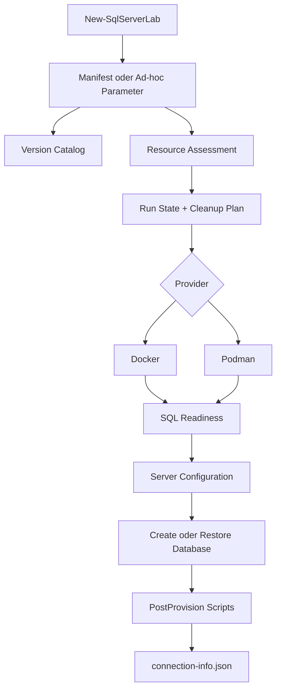

# SQL Server Lab

---

# ⚠️ READ BEFORE USE

## License notice

**NOTICE: This software is NOT Open Source. Use is governed by a custom Attribution & Non-Commercial Redistribution License.**

1. **NO RESALE:** Selling, renting, leasing, or charging third parties for access to this repository, its scripts, lab definitions, templates, documentation, or generated project content is prohibited.
2. **ATTRIBUTION REQUIRED:** The copyright notice for **gecompat - Gerhard Pisch** must be preserved.
3. **NO LIABILITY:** Use is at your own risk. Lab scenarios may deliberately create resource pressure, failures, configuration changes, or destructive states inside isolated lab scopes.

The complete terms are defined in [LICENCE.md](./LICENCE.md).

---

## Zweck

`SQL_Server_Lab` erstellt lokale, isolierte und reproduzierbare SQL-Server-Testumgebungen. Das PowerShell-Modul kapselt Provisionierung, Ressourcenprüfung, Container-Lifecycle, SQL-Bereitschaft, Datenbankerstellung, Restore, Skriptausführung, lokalen Run-State und Cleanup.

Das Repository dient insbesondere als gemeinsame Ausführungsbasis für:

- [`gecompat/SQL_Server_Analyze`](https://github.com/gecompat/SQL_Server_Analyze)
- [`gecompat/SQL_PerformanceSchulung`](https://github.com/gecompat/SQL_PerformanceSchulung)
- [`gecompat/SQL_Server_Toolbelt`](https://github.com/gecompat/SQL_Server_Toolbelt)

`SQL_PerformanceSchulung` verwendet überwiegend eine aktuelle Linux-Umgebung
zur Konstruktion von Beispielen und kann für besondere Konstellationen Windows
oder eine andere katalogisierte SQL-Version anfordern. `SQL_Server_Analyze` und
`SQL_Server_Toolbelt` verwenden Windows- und Linux-Umgebungen mit SQL Server
2019, 2022 und 2025 für versionsabhängige Entwicklungs- und Abnahmetests. Die
fachlichen Inhalte und Nachweise bleiben in den konsumierenden Projekten;
`SQL_Server_Lab` stellt den generischen Umgebungs- und Lifecyclepfad bereit und
testet seinen Core je Provider nur mit SQL Server 2025.

## Aktueller Status

**Status:** `CONTAINER_CORE_IMPLEMENTED_HYPERV_SQL_CLI_ACCEPTED`

| Bereich | Status | Nachweis |
|---|---|---|
| PowerShell-Modul | implementiert | `SqlServerLab.psd1`, `SqlServerLab.psm1` |
| Docker-Provider | implementiert | `Providers/Docker/DockerProvider.ps1` |
| Podman-Provider | implementiert | `Providers/Podman/PodmanProvider.ps1` |
| SQL Server 2022 External Languages | Python, R und Java für Docker/Linux, Podman/Linux und Hyper-V/Windows unterstützt und providergetrennt nativ akzeptiert | `Catalogs/software.json`, `Tests/Integration/Invoke-ExternalRuntimeContainerAcceptance.ps1`, `Tests/Integration/Invoke-ExternalRuntimeHyperVAcceptance.ps1` |
| Gemischter Docker-/Podman-Lifecycle | implementiert | `Documentation/Architecture/MIXED_PROVIDER_LIFECYCLE.md` |
| Hyper-V-Provider | Lifecycle einschließlich Gast-Drives, Windows-Specialization, SQL-Readiness, Image-Registry, Windows-Builder und resumierbarem SQL-`PrepareImage`-Builder implementiert; frischer Windows-Slot mit echter SQL-2025-Installation, Datenbank-/Storage-/Ressourcenänderungen, Lifecycle und Cleanup CLI-seitig akzeptiert | `Providers/HyperV/HyperVProvider.ps1`, `Private/HyperVImageBuilder.ps1`, `Private/HyperVSqlImageBuilder.ps1`, `Tests/Integration/Invoke-HyperVCliAcceptance.ps1` |
| Ad-hoc-Provisionierung | implementiert | `New-SqlServerLab -Version ... -Provider ...` |
| Providerneutrale Batch-, Queue- und Resume-Provisionierung | implementiert | `Private/BatchWorkflow.ps1`, `Public/BatchWorkflow.ps1`, `Schemas/lab-batch.schema.json` |
| Manifest-Provisionierung | primärer unbeaufsichtigter Containerpfad; externe Secret-Referenzen, SHA-256-Restores und sichere Mount-Defaults | `Schemas/lab-manifest.schema.json`, `Documentation/Architecture/TEMPLATE_POOL_AND_AUTOMATED_MANIFESTS.md` |
| Resource Assessment | implementiert | `Test-SqlServerLabPrerequisite` |
| Run-State und Cleanup-Plan | implementiert | `Private/StateMachine.ps1`, `Private/CleanupEngine.ps1` |
| Datenbankerstellung | implementiert | `New-SqlServerLabDatabase` |
| Backup-Restore mit Artifact Resolver | implementiert | `Restore-SqlServerLabDatabase`, `Private/ArtifactResolver.ps1` |
| Sample-Datenbanken (Backup) | implementiert | `Private/SampleArtifactHandlers.ps1`; direkte `.bak`-Varianten über Trust-/Hash-Pfad, Mehrfachauswahl im Menü und `New-SqlServerLab -Sample` |
| Project Adapter (v0.1) | implementiert | `Schemas/project-adapter.schema.json`, `Test-SqlServerLabAdapter`, `Install-SqlServerLabAdapter`; T-SQL-Entrypoints ohne Lifecycle-Seiteneffekt |
| T-SQL-Skriptausführung | implementiert | `Invoke-SqlServerLabScript` |
| Provider-/Versions-/Parallel-Smoke-Test | implementiert | `Tests/Integration/Invoke-SmokeMatrix.ps1` |
| Einzelprovider-Smoke-Test | implementiert | `Tests/Integration/Invoke-SmokeTest.ps1` |
| Statische Konsistenzprüfung | implementiert | `Tests/Static/Invoke-DocumentationChecks.ps1` |

Die [bekannten Grenzen](Documentation/Quality/KNOWN_LIMITATIONS.md) sind Teil des öffentlichen Vertrags. Planungsdokumente sind kein Runtime-Nachweis.

Der normale Menüpfad plant einzelne und mehrere SQL-/Windows-Umgebungen
providerneutral. `ProviderPreference = Auto` ist der Standard; Docker, Podman
oder Hyper-V können nur unter den erweiterten Eigenschaften explizit gewählt
werden. Hyper-V-spezifische Vorlagen-, ISO-, Slot- und Recovery-Aufgaben bleiben
im eigenen Infrastrukturbereich.
Alle Provider unterstützen `instances[].autostart: "on"`. Hyper-V verwendet
`AutomaticStartAction=Start`; Docker und Podman erhalten `unless-stopped` sowie
ein Lab-Label. Unter Windows startet ein benutzergebundener Auftrag nach der
Anmeldung Docker Desktop beziehungsweise die Podman Machine und anschließend
nur markierte Lab-Container. Ohne Angabe bleibt Autostart ausgeschaltet;
`instances[].hyperv.autostart` bleibt als Kompatibilitätsalias lesbar.
Docker und Podman trennen das harte Containerlimit von einem niedrigeren
SQL-internen Memory-Limit. Automatisierte Linux-Testziele verwenden 4 GB
Container-RAM und 3 GB `max server memory`; ihr Export wird nur bei einem
laufenden und gesunden gebundenen Container als `READY` veröffentlicht.
Vollständige deklarative Hyper-V-Drives, Datenbanken und Network Intents bleiben
bis zu ihrem echten End-to-End-Nachweis begrenzt.

## Voraussetzungen

Mindestens erforderlich:

- PowerShell 7.2 oder neuer
- Docker oder Podman
- WSL 2 und aktivierte Hardwarevirtualisierung bei Windows-Containerruntimes
- mindestens 4 GB freier RAM für ein kleines Lab
- mindestens 5 GB freier Speicherplatz
- `sqlcmd` für Datenbankerstellung, Restore, Skriptausführung und den vollständigen Smoke-Test
- Git für Klonen und Aktualisieren des Repository; bei ZIP-Bezug optional

Die vollständige Einrichtung mit offiziellen Downloadlinks, Installationsbefehlen,
Docker-/Podman-Auswahl und `podman machine start podman-machine-default` steht in
der [Windows-Installationsanleitung für AnwenderInnen](Documentation/User/INSTALLATION_WINDOWS.md).
Der native Ubuntu-Pfad ist getrennt in der
[Linux-Installationsanleitung](Documentation/User/INSTALLATION_LINUX.md)
beschrieben. ISO-, VHDX- und SQL-Installationsmedien liegen in einem
operatorseitig angegebenen [externen Media Root](Documentation/HowTo/MEDIA_ROOT_LAYOUT.md),
nicht im Repository.
Eine optionale Windows-OS-Baseline wird über die
[Hyper-V-Image-Build-Anleitung](Documentation/HowTo/HYPERV_WINDOWS_IMAGE_BUILD.md)
aus der verifizierten ISO erstellt. Wiederverwendbare SQL-Prepared-Images
werden gemäß der
[SQL-Prepared-Image-Anleitung](Documentation/HowTo/HYPERV_SQL_PREPARED_IMAGE.md)
standardmäßig als differenzierende VMs aus einer veröffentlichten OS-Baseline
erstellt; dadurch entfällt die Windows-Neuinstallation je SQL-Version.
Austauschbare Evaluation-Images und langlebige Daten trennt der
[Data-Root- und Refresh-Vertrag](Documentation/HowTo/PERSISTENT_DATA_AND_EVALUATION_REFRESH.md).
Die zusätzlichen Voraussetzungen für Entwicklung, Provider-Smoke-Tests,
Self-hosted Runner und Hyper-V beschreibt die
[Entwicklungs- und Testumgebung](Documentation/Development/DEVELOPMENT_AND_TEST_SETUP_WINDOWS.md).
Für einen geführten Überblick über Windows-Baselines, SQL-Prepared-Images und
offene Schritte steht außerdem die [lokale Workflow-Oberfläche](Documentation/HowTo/WORKFLOW_UI.md) bereit. Der
[Vorlagen- und Manifestvertrag](Documentation/Architecture/TEMPLATE_POOL_AND_AUTOMATED_MANIFESTS.md)
trennt dabei immutable Vorlagen, wegwerfbare Labs und explizite Expertenaktionen.

Runtime prüfen:

```powershell
$PSVersionTable.PSVersion
docker info
# oder
podman info

sqlcmd -?
```

## Schnellstart

Repository klonen und Modul importieren:

```powershell
git clone https://github.com/gecompat/SQL_Server_Lab.git
Set-Location .\SQL_Server_Lab
Import-Module .\SqlServerLab.psd1 -Force
```

Ressourcen prüfen, ohne etwas zu verändern:

```powershell
Test-SqlServerLabPrerequisite -Provider docker
# oder
Test-SqlServerLabPrerequisite -Provider podman
```

Eine SQL-Server-2025-Umgebung erstellen:

```powershell
$lab = New-SqlServerLab -Version '2025' -Provider docker -AutoStart on
```

Mit Podman:

```powershell
$lab = New-SqlServerLab -Version '2025' -Provider podman -AutoStart on
```

Interaktive Bedienung:

```powershell
Invoke-SqlServerLab
```

Standard für Skript-Hilfeeinträge (`-ShowHelp` und `--help`; `/?` sowie
`-help`/`-h`/`-?` können je nach PowerShell-Kontext die Engine-Hilfe auslösen):

```powershell
.\Invoke-SqlServerLab.ps1 -ShowHelp
.\Tools\Initialize-SqlServerLabDataRoot.ps1 -ShowHelp
.\Tools\Initialize-SqlServerLabMediaRoot.ps1 -ShowHelp
.\Tools\Start-SqlServerLabUi.ps1 -ShowHelp
.\CheckLargeGitFilesPush.ps1 --help
```

Wenn einer dieser Schalter erkannt wird, wird die Skript-Hilfe angezeigt und die
Ausführung beendet.

Status anzeigen:

```powershell
Get-SqlServerLab
```

## Verbindung herstellen

`New-SqlServerLab` liefert pro Instanz Host, Port und Connection String zurück.

```powershell
$instance = $lab.Instances[0]
$instance.Host
$instance.Port
$instance.ConnectionString
```

Beispiel für SSMS:

```text
Server name: 127.0.0.1,14330
Authentication: SQL Server Authentication
Login: sa
Password: das bei der Erstellung gesetzte SA-Passwort
Trust server certificate: aktiviert
```

Der konkrete Port wird dynamisch im Bereich `14330` bis `14399` vergeben, sofern kein Port vorgegeben wurde.

## Datenbank erstellen

```powershell
$pw = Read-Host 'SA-Passwort' -AsSecureString

New-SqlServerLabDatabase `
    -Port $lab.Instances[0].Port `
    -SaPassword $pw `
    -DatabaseName 'MeineTestDB'
```

Dateien können auf gemountete Containerpfade gelegt werden:

```powershell
New-SqlServerLabDatabase `
    -Port $lab.Instances[0].Port `
    -SaPassword $pw `
    -DatabaseName 'PerfDB' `
    -DataFiles @(
        @{ name = 'PerfDB_Data1'; path = '/sqldata/PerfDB_Data1.mdf'; sizeMB = 512 },
        @{ name = 'PerfDB_Data2'; path = '/sqldata/PerfDB_Data2.ndf'; sizeMB = 512 }
    ) `
    -LogFiles @(
        @{ name = 'PerfDB_Log'; path = '/sqllog/PerfDB_Log.ldf'; sizeMB = 256 }
    )
```

Die Zielpfade müssen als `drives` beziehungsweise Volumes in der Labdefinition bereitgestellt sein.

## T-SQL-Skript ausführen

```powershell
Invoke-SqlServerLabScript `
    -ScriptPath '.\setup.sql' `
    -Port $lab.Instances[0].Port `
    -SaPassword $pw `
    -Database 'MeineTestDB'
```

Relative `postProvision`-Pfade in Manifesten werden relativ zum Manifest-Verzeichnis aufgelöst.

## Backup wiederherstellen

Manueller Restore:

```powershell
Restore-SqlServerLabDatabase `
    -Port $lab.Instances[0].Port `
    -SaPassword $pw `
    -BackupSource 'C:\Backups\AdventureWorks2022.bak' `
    -DatabaseName 'AdventureWorks2022' `
    -ContainerName $lab.Instances[0].ContainerName
```

Fuer einen bereits provisionierten Run ist die RunId-basierte Aufloesung
bevorzugt; sie liest Provider, Container, Host und Port aus dem lokalen State:

```powershell
Restore-SqlServerLabDatabase `
    -RunId $lab.RunId `
    -InstanceId 'primary' `
    -SaPassword $pw `
    -BackupSource 'C:\Backups\AdventureWorks2022.bak' `
    -DatabaseName 'AdventureWorks2022'
```

Eine HTTPS-URL kann ebenfalls als `BackupSource` verwendet werden. Sie wird
zuerst in einen lokalen Staging-Bereich geladen, per SHA-256 geprüft und danach
unter diesem Digest im inhaltsadressierten State-Cache gespeichert. Fehlt eine
bekannte Prüfsumme, fragt ein interaktiver Aufruf einmalig nach Vertrauen und
registriert den berechneten Hash lokal. Mit `-NonInteractive` endet derselbe
Fall ohne Download mit `TRUST_REQUIRED`.

## Manifest-Modus

Ein Manifest kann vollstaendig in der Konsole erstellt werden. Der Wizard liest
Pflichtfelder, optionale Felder, Typen, Wertebereiche und Auswahlwerte direkt
aus dem JSON-Schema. Pfade zeigen dabei ihren Host-/Gast-/SQL-Server-Scope,
ihre Bezugsbasis, Default- und Erzeugungsregel sowie bei relativen Hostwerten
eine aufgelöste Vorschau:

```powershell
New-SqlServerLabManifest -Path '.\mein-lab.json'
```

Alternativ steht im Hauptmenue die Aktion `m` zur Verfuegung:

```powershell
Invoke-SqlServerLab -Action Manifest
```

Ein vorhandenes Manifest kann ohne Provisionierung geprueft werden:

```powershell
$result = Test-SqlServerLabManifest -Path '.\mein-lab.json'
$result.Errors
$result.Warnings
$result.Plan.Instances.ExternalRuntimes.Entries
```

Fehler verhindern das Speichern beziehungsweise Provisionieren. Warnungen
kennzeichnen unter anderem vorbereitete Schemafelder ohne stabilen Runtimepfad
und riskante SQL-Konfigurationen. Bei `software` bietet der interaktive Wizard
nur Varianten an, die der Software-Resolver fuer die bereits gewählte
SQL-Version, den Provider und das Betriebssystem als `RESOLVED` freigibt. Die
mutationsfreie Planvorschau nennt Artifact-Downloads, Derived-Image-Build oder
Gastmutation, Restarts, Downtime, Package Locks, Verification und den sicheren
Aenderungsweg (`rebuild`, `restart`, `recreate` oder `reprovision`). Ein
gespeichertes Manifest läuft standardmäßig
unbeaufsichtigt: fehlende Voraussetzungen stoppen mit einem Fehler statt eine
Passwort- oder Trust-Abfrage zu öffnen.

```json
{
  "$schema": "./Schemas/lab-manifest.schema.json",
  "name": "mein-erstes-lab",
  "automation": {
    "mode": "unattended",
    "secrets": {
      "saPassword": "SQL_SERVER_LAB_SECRET_SA_PASSWORD"
    }
  },
  "instances": [
    {
      "id": "primary",
      "version": "2025",
      "provider": "docker",
      "profile": "standard",
      "databases": [
        {
          "name": "AppDB",
          "options": {
            "recoveryModel": "FULL",
            "queryStore": true
          }
        }
      ]
    }
  ]
}
```

Ausführen:

```powershell
$env:SQL_SERVER_LAB_SECRET_SA_PASSWORD = '<aus Secret Store oder CI-Injection>'
$lab = New-SqlServerLab -Manifest '.\mein-lab.json'
Remove-Item Env:SQL_SERVER_LAB_SECRET_SA_PASSWORD
```

Das Manifest enthält damit nur den Namen der Prozessvariablen, nie den
Passwortwert. Remote-Backups benötigen für automatisierte Läufe eine
`restore.sha256`; ohne bekannte Prüfsumme endet der Lauf mit `TRUST_REQUIRED`.
Für zentrale Testdatenbibliothek, Data Root, die maximal 20 immutable Vorlagen
und den ausdrücklich doppelten Opt-in für schreibende Host-Mounts siehe den
[Vorlagen- und Manifestvertrag](Documentation/Architecture/TEMPLATE_POOL_AND_AUTOMATED_MANIFESTS.md).

Vollständige Beispiele liegen unter [`Schemas/`](Schemas/README.md).

## Sample-Datenbanken

Katalogisierte Testdatenbanken mit `runtimeStatus: executable` werden über den
typisierten Sample-Handler installiert. Unterstützt sind direkte `.bak`-Files,
ZIP-Dateien mit einer exakten katalogisierten `.bak`-Payload (temporär
entpackt) sowie gepinnte einzelne T-SQL-Skripte. Die Integrität sichert der
Artifact Resolver: Eine im Katalog hinterlegte SHA-256 wird erzwungen; fehlt
sie, fragt ein interaktiver Lauf einmalig nach Vertrauen (`interactive-once`),
registriert den berechneten Hash im lokalen Trust Store und legt das Artefakt
im inhaltsadressierten Cache ab. Nicht interaktive Läufe enden ohne bekannten
Hash mit `TRUST_REQUIRED`.

Ad-hoc können mehrere Samples pro Instanz gewählt werden – im Menü von
`Invoke-SqlServerLab` über den Schritt `Testdatenbanken` oder direkt:

```powershell
$lab = New-SqlServerLab `
    -Version '2022' `
    -Provider docker `
    -Sample 'adventureworks-2022:lightweight', 'wideworldimporters:standard'
```

Die Zieldatenbanknamen ergeben sich aus den erwarteten Katalog-Outputs.
Kollidierende Ausgaben werden als `SAMPLE_OUTPUT_CONFLICT` abgewiesen. Nach der
Installation verifiziert der Handler die erwartete Datenbank als `ONLINE`
(`DATASET_READY`); eine bereits vorhandene Zieldatenbank blockiert die
Installation gemäß `fail-if-exists`.

Im Manifest bleibt die deklarative Referenz unverändert:

```json
{
  "name": "adventureworks-lab",
  "instances": [
    {
      "id": "primary",
      "version": "2022",
      "provider": "docker",
      "databases": [
        {
          "name": "AdventureWorks2022",
          "sample": {
            "id": "adventureworks-2022",
            "variant": "full"
          }
        }
      ]
    }
  ]
}
```

`Northwind` und `Chinook` sind als SHA-256-verifizierte Skript-Samples direkt
wählbar. Katalogisierte `.7z`-Archive mit genau einer `.bak`-Payload werden
nach expliziter lokaler 7-Zip-Installation unterstützt. Große `.7z`-Archive
mit MDF/LDF-Dateien, Script-Bundles und Attach-Szenarien bleiben bewusst
beschreibend und werden nicht als Backup oder Skript umgedeutet.

Der verbindliche Zielvertrag für weitere Script-Bundle-Handler, kontextreiche
Pfadführung und `LAB_GENERATED`-Baselines ist in
[Testdatenbank-Provisionierung und menügeführte Manifest-Erstellung](Documentation/Architecture/SAMPLE_DATABASE_PROVISIONING_AND_MANIFEST_WIZARD.md)
dokumentiert; diese Teile bleiben für spätere Wellen vorgesehen.

## Project Adapter

Konsumierende Projekte koppeln sich über einen versionierten Adaptervertrag an
den Lab-Core (`Schemas/project-adapter.schema.json`, Version `0.1-draft`).
Version 0.1 führt ausschließlich relative T-SQL-Entrypoints innerhalb des
Adapter-Roots aus; Pfad-Traversierung, absolute Pfade und unbekannte
Major-Vertragsversionen werden abgelehnt.

```powershell
Test-SqlServerLabAdapter -Path '.\Adapters\Examples\synthetic-demo'

Install-SqlServerLabAdapter `
    -Path '.\Adapters\Examples\synthetic-demo' `
    -RunId $lab.RunId `
    -SaPassword $pw
```

`Install-SqlServerLabAdapter` hat keinen Lifecycle-Seiteneffekt: Container,
Volumes und Run-State bleiben unverändert; es laufen nur die deklarierten
SQL-Entrypoints (`preflight`, `install`, `update`, `validate`, `cleanup`).
Details stehen in [Adapters/README.md](Adapters/README.md), die Roadmap in der
[Project-Adapter-Priorisierung](Documentation/Project_Planning/PROJECT_ADAPTER_PRIORITIZATION.md).

## Lifecycle

```powershell
Stop-SqlServerLab -RunId $lab.RunId
Start-SqlServerLab -RunId $lab.RunId
Restart-SqlServerLab -RunId $lab.RunId
Remove-SqlServerLab -RunId $lab.RunId
```

Der Lifecycle verwendet den pro Instanz gespeicherten Provider. Eine Podman-
Instanz wird daher auch dann über Podman verwaltet, wenn Docker zusätzlich
installiert ist. Ein Manifest kann Docker- und Podman-Instanzen in einem Run
kombinieren; Status, Start, Stop und Cleanup arbeiten dafür je ProviderSubRun.

Alle erkannten Lab-Reste bereinigen:

```powershell
Clear-SqlServerLab
```

Container-Batches laufen immer non-interaktiv. Deshalb referenziert der Plan
nur den Namen einer eng benannten Prozessvariable; der Secret-Wert selbst wird
nicht in Batch-, Operation- oder Event-State geschrieben:

```powershell
$env:SQL_SERVER_LAB_SECRET_BATCH_SA_PASSWORD = '<aus Secret Store oder CI-Injection>'
$batch = New-SqlServerLabBatch `
    -Name 'Zwei Docker-Labs' `
    -Defaults @{
        ProviderPreference = 'docker'
        Version = '2025'
        SaPasswordEnvironmentVariable = 'SQL_SERVER_LAB_SECRET_BATCH_SA_PASSWORD'
    } `
    -Items @(@{ id = 'sql'; kind = 'SqlEnvironment'; count = 2 })
Invoke-SqlServerLabScheduler -UntilIdle
```

## Öffentliche Cmdlets

| Cmdlet | Zweck |
|---|---|
| `Invoke-SqlServerLab` | Interaktives Menü |
| `New-SqlServerLabBatch` | Eine oder mehrere Positionen expandieren, vollständig validieren und persistent einreihen; `-Manifest` setzt einen eindeutigen offenen Lauf fort |
| `Get-SqlServerLabBatch` | Batchzustand, Review, Abhängigkeiten, Fortschritt und Cleanup-Scope lesen |
| `Get-SqlServerLabQueue` | Worker, Locks, nächste startbare Position, Blockierungsgründe und User-Gates lesen |
| `Get-SqlServerLabOperation` | Persistente Kindvorgänge, Schritte, Receipts und Events lesen |
| `Confirm-SqlServerLabOperationUserAction` | Ausgewählte User-Gates einzeln technisch prüfen und nur erfolgreiche Positionen fortsetzen |
| `Move-SqlServerLabOperation` | Wartenden Vorgang innerhalb seiner Priorität umreihen |
| `Set-SqlServerLabOperationPriority` | Individuelle Vorgangspriorität setzen |
| `Set-SqlServerLabBatchPriority` | Batchpriorität an nicht individuell überschriebene Kindvorgänge weitergeben |
| `Suspend-SqlServerLabOperation` / `Resume-SqlServerLabOperation` | Wartenden Vorgang pausieren oder wieder freigeben |
| `Stop-SqlServerLabOperation -Cleanup` | Vorgang an sicherer Schrittgrenze stoppen und scopegebunden bereinigen |
| `Stop-SqlServerLabBatch -Cleanup` | Unfertige Positionen stoppen oder mit `-IncludeCompleted` den gesamten Batch nach zweiter Review zurückbauen |
| `Invoke-SqlServerLabScheduler` | Persistente Queue mit zwei Workern und maximal einem `HyperVHeavy`-Vorgang verarbeiten |
| `Invoke-SqlServerLabOperationProbe` | Fällige User-Gates ausschließlich lesend prüfen, ohne sie selbstständig fortzusetzen |
| `Get-SqlServerLabWorkflow` | Konsolidierte Workflow-, Image-, Vorlagenpool- und Kombinationsübersicht ohne Geheimnisse |
| `Get-SqlServerLabCatalog` | Konsolidierten Lab-Katalog als JSON-Artefakt erzeugen |
| `Get-SqlServerLabCleanupAudit` | Bekannte Lab-Daten und Runtime-Ressourcen read-only auf Reste prüfen |
| `Get-SqlServerLabConnectionCenter` | Passwortfreien, providerübergreifenden SQL-Endpunktkatalog ermitteln |
| `Sync-SqlServerLabConnectionCenter` | Den Endpunktkatalog der SSMS-/CMS-Verbindungszentrale aktualisieren |
| `Export-SqlServerLabSsmsRegistration` | Kennwortfreien `.regsrvr`-Import für SSMS erzeugen |
| `Export-SqlServerLabCmsSyncScript` | Idempotentes Synchronisationsskript für einen vorhandenen CMS erzeugen |
| `Initialize-SqlServerLabCms` | Kompakten persistenten Docker-/Podman-CMS nach expliziter Auswahl anlegen |
| `Sync-SqlServerLabCms` | Verwalteten lokalen CMS mit dem aktuellen Endpunktkatalog abgleichen |
| `Get-SqlServerLabReconcilePlan` | Read-only Plan für Lifecycle oder resolvergebundenen External-Runtime-Reconcile |
| `Invoke-SqlServerLabReconcileAction` | `START`/`STOP` oder validierten External-Runtime-Container-Reconcile ausführen |
| `Invoke-SqlServerLabWorkflowAction` | Nicht interaktive Hyper-V-Workflow-Aktion für die lokale Oberfläche |
| `New-SqlServerLabManifest` | Schema-gesteuertes Manifest in der Konsole erstellen |
| `Test-SqlServerLabManifest` | Manifest ohne Provisionierung strukturell und fachlich prüfen |
| `New-SqlServerLab` | Umgebung ad hoc oder per Manifest erstellen |
| `Get-SqlServerLab` | State und Live-Status anzeigen |
| `Start-SqlServerLab` | Gestoppte Umgebung starten |
| `Stop-SqlServerLab` | Laufende Umgebung stoppen |
| `Restart-SqlServerLab` | Stop und Start kombinieren |
| `Remove-SqlServerLab` | Einzelnen Run entfernen |
| `Clear-SqlServerLab` | Lab-Container und/oder State bereinigen |
| `New-SqlServerLabDatabase` | Datenbank erstellen |
| `Restore-SqlServerLabDatabase` | `.bak` aus Datei oder URL wiederherstellen |
| `Invoke-SqlServerLabScript` | T-SQL-Skript ausführen |
| `Get-SqlServerLabGeneratedSqlAccess` | Hyper-V SQL-Zugriffsdaten (ConnectionString + generiertes SA-Passwort) aus dem Run abrufen |
| `New-SqlServerLabAutomatedTestEnvironment` | Linux-Testumgebungen mit getrennten Zufallskennwörtern erstellen und nach Lab_Data exportieren |
| `Export-SqlServerLabTestEnvironment` | Registrierte Testumgebungen als dotenv, schema-validierbares JSON, portablen Agenten-Prompt und Markdown exportieren |
| `Repair-SqlServerLabAutomatedTestEnvironment` | Ressourcen- und Health-Vertrag der registrierten Linux-Mitglieder mit einzelnem Rollback reparieren |
| `Start-SqlServerLabAutomatedTestEnvironment` | Registrierte Windows-Hyper-V-Mitglieder als Gruppe starten, SQL-Dienste bereitstellen und live bis `READY` prüfen |
| `Stop-SqlServerLabAutomatedTestEnvironment` | Registrierte Windows-Hyper-V-Mitglieder nicht-destruktiv stoppen, Hostkapazität freigeben und den Export fail-closed erneuern |
| `Clear-SqlServerLabAutomatedTestEnvironment` | Alle automatisierten Testumgebungen als geschützte Gruppe gemeinsam entfernen |
| `Test-SqlServerLabPrerequisite` | Provider, RAM, Storage und Ports prüfen |
| `Test-SqlServerLabAdapter` | Project Adapter gegen Schema, Pfadgrenzen und optional einen Run prüfen |
| `Install-SqlServerLabAdapter` | Validierten Adapter-Entrypoint ohne Lifecycle-Seiteneffekt anwenden |
| `Install-SqlServerLab7Zip` | 7-Zip für katalogisierte `.7z`-Backup-Payloads ausdrücklich und optional über `winget` installieren |

`SqlServerLab.psd1` ist die autoritative Liste der exportierten Funktionen.

## State und lokale Daten

Run-State liegt außerhalb des Git-Checkouts:

- Windows: `%LOCALAPPDATA%\SqlServerLab`
- Linux/macOS: `~/.sql-server-lab`
- Override: Environment Variable `SQL_SERVER_LAB_STATE`

Pro Run entstehen unter anderem:

- `run-state.json`
- `cleanup-plan.json`
- `connection-info.json`
- lokale Secret-Dateien
- `trust/sample-artifacts.json`
- `cache/artifacts/sha256/<sha256>/`
- `cache/quarantine/`
- `runs/<RunId>/manifest.lock.json` bei URL-basierten Artifacts

Diese Dateien enthalten konkrete Laufzeitinformationen und gehören nicht in Git.

## Architekturüberblick



## Quellen der Wahrheit

| Aussage | Autoritative Quelle |
|---|---|
| Exportierte Cmdlets | `SqlServerLab.psd1` |
| Modul-Ladevorgang | `SqlServerLab.psm1` |
| Manifestfelder | `Schemas/lab-manifest.schema.json` |
| Batch-Manifestfelder | `Schemas/lab-batch.schema.json` |
| Manifest-Eingabe und Fachvalidierung | `Private/ManifestBuilder.ps1` plus `Private/ManifestParser.ps1` |
| SQL-Versionen und Images | `Catalogs/sql-server-versions.json` |
| Sample-Datenbanken | `Catalogs/sample-databases.json` |
| Provider-Funktion | `Providers/*/*.ps1` |
| Provider-Metadaten | `Providers/*/provider.json` |
| State und Übergänge | `Private/StateMachine.ps1` |
| Batch-, Queue-, Lease-, User-Gate- und Resume-Vertrag | `Private/BatchWorkflow.ps1` |
| Cleanup-Verhalten | `Private/CleanupEngine.ps1` |
| Aktuelle Einschränkungen | `Documentation/Quality/KNOWN_LIMITATIONS.md` |
| KI-Landkarte | `.ai/repo_map.yaml` |
| KI-Arbeitsvertrag | `AGENTS.md` |
| Anbieterneutrale kosten- und qualitätsoptimierte Verarbeitung | `.ai/MODEL_ROUTING_POLICY.md` |
| Kosten- und kontexteffiziente Entwicklung | `Documentation/Quality/COST_EFFICIENT_DEVELOPMENT.md` |

## Tests und Validierung

Vor jedem Push/Release ist zusätzlich die lokale Readiness-Checkliste sinnvoll:

```powershell
.\Documentation\Quality\LOCAL_READINESS_CHECKLIST.md
```

Sie bündelt die empfohlene Reihenfolge für statische und Integration-Checks sowie häufige Umgebungsfehlerursachen.

Statische Konsistenz- und Readiness-Prüfungen:

```powershell
.\Tests\Static\Invoke-ManifestBuilderChecks.ps1
.\Tests\Static\Invoke-BatchWorkflowChecks.ps1
.\Tests\Static\Invoke-DocumentationChecks.ps1
.\Tests\Static\Invoke-ReadinessContractChecks.ps1
.\Tests\Static\Invoke-MixedProviderLifecycleChecks.ps1
.\Tests\Static\Invoke-ArtifactResolverChecks.ps1
.\Tests\Static\Invoke-SampleHandlerChecks.ps1
.\Tests\Static\Invoke-ProjectAdapterChecks.ps1
```

Einzelprovider-Smoke-Test:

```powershell
.\Tests\Integration\Invoke-SmokeTest.ps1 -Provider docker
.\Tests\Integration\Invoke-SmokeTest.ps1 -Provider podman
.\Tests\Integration\Invoke-SmokeTest.ps1 -Provider hyperv
.\Tests\Integration\Invoke-MixedProviderSmokeTest.ps1
.\Tests\Integration\Invoke-RestoreSmokeTest.ps1 -Provider docker
.\Tests\Integration\Invoke-RestoreSmokeTest.ps1 -Provider podman
```

Aktueller lokaler Validierungsnachweis (2026-08-08):

```text
Invoke-SmokeTest.ps1 -Provider docker   => 33/33 PASS, 0 FAIL
Invoke-SmokeTest.ps1 -Provider podman   => 33/33 PASS, 0 FAIL
Invoke-SmokeTest.ps1 -Provider hyperv   => PASS (Hyper-V-Lifecycle)
Invoke-SmokeMatrix.ps1                 => PASS=5 FAIL=0 SKIP=0
```

Providerübergreifender Lifecycle-Test für alle lokal erreichbaren Provider mit
der SQL-Server-2025-Referenzversion:

```powershell
.\Tests\Integration\Invoke-SmokeMatrix.ps1
```

Optionaler Parallelitätsnachweis mit derselben Referenzversion:

```powershell
.\Tests\Integration\Invoke-SmokeMatrix.ps1 `
    -Provider all `
    -IncludeParallel
```

SQL_Server_Lab verwendet für seine Runtime-Gates ausschließlich SQL Server
2025. Mehrversions-Abnahmen für 2019/2022/2025 sind Aufgabe der konsumierenden
Partnerprojekte SQL Analyze und Toolbelt; der Lab-Core hält dafür weiterhin den
katalogbasierten Auflösungspfad bereit.

Nicht erreichbare Provider werden als `SKIP` ausgewiesen. Erreichbare, aber fehlerhafte Provider führen zu `FAIL` und Exitcode `1`. Details zu Testumfang, Parallelitätsvertrag und Remote Runnern stehen in [Tests/README.md](Tests/README.md).

Für eine reproduzierbare lokale Release-Kopie:

```powershell
.\Tools\Prepare-LocalRelease.ps1 -CreateArchive -IncludeHashManifest
```

## Repository-Struktur

```text
.ai/             KI-Kontext, Arbeitsregeln und Repo-Map
Adapters/        Project-Adapter-Vertrag und synthetische Beispiele
Catalogs/        SQL-Versionen und Sample-Datenbank-Metadaten
Documentation/   Benutzer-, Architektur-, Qualitäts- und Planungsdokumentation
Private/         interne Modulbausteine
Providers/       Docker, Podman und Hyper-V-Lifecycle
Public/          exportierte Cmdlets
Schemas/         JSON-Schemas und ausführbare Beispiele
Tests/           statische Prüfungen sowie Lifecycle-, Matrix- und Paralleltests
_QuellRepo/      unveränderte Quell-Snapshots anderer Repositories
```

## Weiterführende Dokumentation

- [Konsolidierter Entwicklungs- und Ausführungsplan](Documentation/Project_Planning/DEVELOPMENT_EXECUTION_PLAN_2026-08-08.md)
- [Konsolen-, Lifecycle- und Storage-Konsolidierungsplan aus der manuellen Abnahme](Documentation/Project_Planning/CONSOLE_LIFECYCLE_AND_STORAGE_CONSOLIDATION_PLAN_2026-08-12.md)
- [Providerneutraler Batch-, Queue- und Resume-Workflow](Documentation/Project_Planning/PROVIDER_NEUTRAL_BATCH_QUEUE_RESUME_WORKFLOW_2026-08-13.md)
- [Getting Started](Documentation/User/Getting_Started.md)
- [Dokumentationsübersicht](Documentation/README.md)
- [Bekannte Grenzen](Documentation/Quality/KNOWN_LIMITATIONS.md)
- [Manifest-Schemas und Beispiele](Schemas/README.md)
- [Testdatenbank-Provisionierung und menügeführte Manifest-Erstellung](Documentation/Architecture/SAMPLE_DATABASE_PROVISIONING_AND_MANIFEST_WIZARD.md)
- [Gemischter Container-Provider-Lifecycle](Documentation/Architecture/MIXED_PROVIDER_LIFECYCLE.md)
- [Hyper-V-, Image-, Provisionierungs- und Netzwerkvertrag](Documentation/Architecture/HYPERV_IMAGE_PROVISIONING_AND_NETWORK_CONTRACT.md)
- [Vorlagenpool und automatisierte Manifeste](Documentation/Architecture/TEMPLATE_POOL_AND_AUTOMATED_MANIFESTS.md)
- [Öffentliche Cmdlets](Public/README.md)
- [Project Adapter](Adapters/README.md)
- [Provider](Providers/README.md)
- [Tests](Tests/README.md)
- [Podman unter Windows](Documentation/HowTo/PODMAN_WINDOWS_NETWORKING.md)
- [KI-Projektkontext](.ai/PROJECT_CONTEXT.md)
- [Maschinenlesbare Repo-Map](.ai/repo_map.yaml)
- [Beitragsregeln](CONTRIBUTING.md)

## CI/CD-Abgrenzung

Lab-Provisionierung bleibt lokal beziehungsweise auf ausdrücklich dafür vorgesehenen Self-hosted Runnern. Runtime-Workflows verwenden die Labels `SQL_Lab` plus `Docker` oder `Podman`; generische Self-hosted Runner werden nicht verwendet. GitHub-hosted Runner sind nur für nicht mutierende, hostunabhängige Prüfungen vorgesehen.
