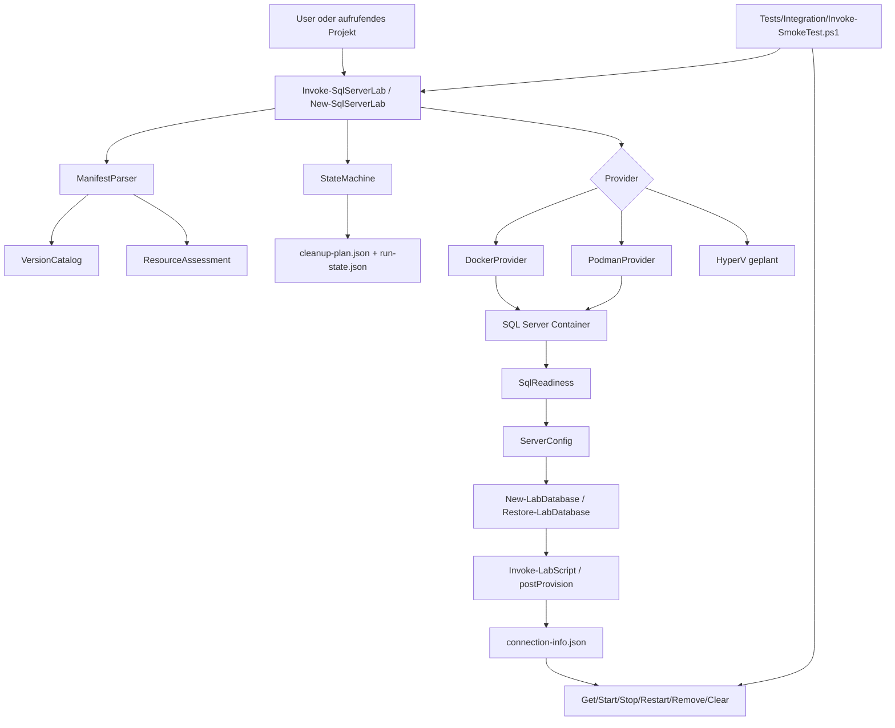
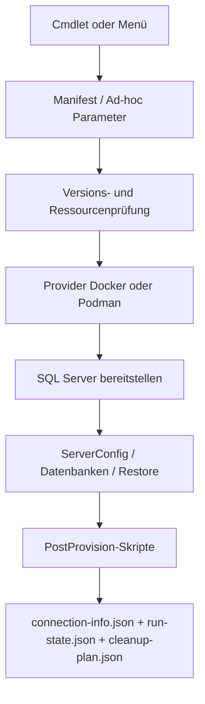

# Analyse der Dokumentationsqualität im Repository SQL_Server_Lab

## Executive Summary

**Empirisch:** Das Repository ist funktional deutlich weiter als die Root-README vermuten lässt. Im öffentlichen Tree liegen ein PowerShell-Modul mit Manifest und Loader, implementierte Docker- und Podman-Provider, Public-Cmdlets für Provisionierung, Status, Start/Stop/Restart/Remove, Restore, Skriptausführung und Datenbankerstellung, dazu interne Bausteine für State, Cleanup, Resource Assessment, Manifest-Parsing, SQL-Readiness und Server-Konfiguration. Außerdem existieren JSON-Schemas, Beispielmanifeste, Katalogdateien und ein Integration-Smoke-Test. Das heißt: Die Grundfunktionalität ist **nicht** bloß geplant, sondern zu erheblichen Teilen bereits implementiert. citeturn46view0turn11view4turn11view5turn15view0turn16view2turn17view1turn18view0turn18view1turn18view2turn16view3

**Dokumentiert + empirisch:** Das größte Problem ist nicht fehlender Code, sondern ein widersprüchlicher Dokumentationszustand. Die Root-README bezeichnet den Stand als `PLANNING_FOUNDATION` und erklärt zentrale Bausteine wie Catalog, Schemas, CLI, Provider, Backup/Restore, Resource Assessment und Recovery als „noch nicht implementiert“. Gleichzeitig dokumentiert die Dokumentationsübersicht diese Bausteine als implementiert, und die Codebasis bestätigt dies. Für Menschen wie auch generische KI-Systeme ist genau diese Front-Door-Inkonsistenz der zentrale Verständnishinderungsgrund. citeturn40view2turn14view0turn11view4turn15view0turn16view2turn16view4turn28view2

**Empirisch:** Neben der Root-README gibt es weitere konkrete Doku-Brüche: falsche Befehlsbeispiele im Getting-Started, veraltete oder nicht existente Artefaktverweise, nicht vorhandene Governance-Dateien wie `CHANGELOG.md`, `CONTRIBUTING.md`, `SECURITY.md`, `CODEOWNERS`, Issue-Templates und Workflow-Dateien, sowie mehrere maschinenlesbare Referenzen auf fehlende Schema-Dateien. Für eine KI-gestützte Weiterentwicklung ist das besonders problematisch, weil deklarierte und tatsächliche Interfaces auseinanderlaufen. citeturn42view0turn43view0turn43view1turn43view2turn24view0turn24view1turn24view2turn24view3turn25view0turn25view1turn27view0turn27view1

**Bewertung:** Der technische Unterbau ist bereits stark genug, um das Projekt produktiv als lokale SQL-Server-Lab-Plattform für Docker und Podman zu verstehen. Die Dokumentation ist jedoch noch **nicht sauber, lückenlos und fehlerfrei**. Meine Hauptempfehlung ist deshalb: zuerst die Root-README zum einzigen verlässlichen Einstieg machen, danach die Dokumentationskonsistenz automatisiert prüfen. Die wichtigste Alternative wäre, primär `Documentation/User/Getting_Started.md` als Front-Door zu verwenden; das ist kurzfristig billiger, behebt aber die Root-README-Fehlwahrheit nicht. citeturn42view0turn45view0turn40view2turn14view0

## Repository-Befund

Die Analyse basiert auf der öffentlich erreichbaren Repository-Struktur und den Rohdateien auf GitHub. Im Root liegen die Verzeichnisse `.ai`, `.vscode`, `Catalogs`, `Documentation`, `Private`, `Providers`, `Public`, `Schemas`, `Tests` und `_QuellRepo` sowie die Kernartefakte `Invoke-SqlServerLab.ps1`, `LICENCE.md`, `README.md`, `SqlServerLab.psd1` und `SqlServerLab.psm1`. Der Modul-Loader dot-sourct Provider-Skripte und Private-Funktionen; das Manifest verlangt PowerShell 7.2 und listet 15 Exportnamen. citeturn46view0turn11view4turn11view5turn12view0

Funktional ist das Repository heute ein lokales Orchestrierungsmodul für isolierte SQL-Server-Umgebungen. `New-SqlServerLab` unterstützt Ad-hoc- und Manifest-Modus, führt Versionsprüfung, Resource Assessment, State-Initialisierung, Provider-Start, SQL-Readiness, Server-Konfiguration, Datenbankerstellung, Restore und Post-Provision-Skripte aus. Zustände werden außerhalb des Git-Checkouts in einem State-Root persistiert; vor Mutationen wird ein Cleanup-Plan angelegt. Das ist eine klare, nachvollziehbare Ablaufkette, die sowohl für Menschen als auch für agents sinnvoll modelliert ist. citeturn9view0turn10view0turn11view0turn18view4turn18view3

Die tatsächlich umgesetzten Provider sind Docker und Podman. Beide besitzen eigene Provider-Dateien und Metadaten; Hyper-V ist als eigener Bereich vorhanden, aber dort ausdrücklich nur als geplant dokumentiert. Die Docker- und Podman-Provider kapseln Verfügbarkeitsprüfung, Portsuche, Container-Lifecycle, Labeling und Health-Checks. Das entspricht der in `.ai/PROJECT_CONTEXT.md` formulierten Architekturentscheidung, Docker und Podman getrennt zu behandeln. citeturn8view0turn12view1turn12view2turn15view0turn16view2turn13view0

Die interne Architektur ist für den Projektzweck gut geschnitten: `Private/ManifestParser.ps1` liest und normalisiert Manifeste, `Private/ResourceAssessment.ps1` prüft Provider, RAM, Storage, Ports und Pfadsicherheit, `Private/SqlReadiness.ps1` implementiert Readiness-/Query-Logik, `Private/ServerConfig.ps1` setzt SQL-Server- und DB-Optionen, `Private/StateMachine.ps1` persistiert Run-Zustände, und `Private/CleanupEngine.ps1` verwaltet maschinenlesbare Cleanup-Pläne. Das ist wesentlich konkreter und implementierter, als die Root-README derzeit signalisiert. citeturn18view0turn16view4turn18view1turn18view2turn18view4turn18view3

Für Nutzer gibt es bereits eine brauchbare Detaildokumentation: `Documentation/User/Getting_Started.md` enthält Voraussetzungen, Import, ersten Run, Manifestmodus, Restore-Beispiele, Cleanup, Troubleshooting und Smoke-Test-Hinweise. Zusätzlich liefern `Schemas/README.md`, `Public/README.md`, `Private/README.md`, `Providers/*/README.md` und `Tests/README.md` Split-Dokumentation pro Bereich. Genau deshalb ist der Hauptmangel kein völliges Fehlen von Doku, sondern das Fehlen eines verlässlichen, konsistenten Einstiegspunkts im Root. citeturn42view0turn20view0turn14view1turn14view2turn14view3turn8view0turn12view2

Die folgende Überblicksgrafik bildet den aktuell aus Code und Doku rekonstruierbaren Datenfluss ab. Sie ist eine Synthese aus Loader, Public-Cmdlets, Providern, State, Cleanup und Tests. citeturn11view5turn9view0turn18view4turn18view3turn16view3



## Kritische Lücken und Inkonsistenzen

Der härteste Widerspruch sitzt in `README.md` im Root. Dort wird der Status als `PLANNING_FOUNDATION` beschrieben und es wird behauptet, SQL Version Catalog, Schemas, CLI, Planner, Provider, Backup-/Restore-Actions, Resource Assessment und Recovery Engine seien noch nicht implementiert. Die Dokumentationsübersicht dokumentiert dieselben Bereiche jedoch bereits als implementiert, und der Code bestätigt das. Solange dieser Widerspruch bestehen bleibt, ist die Root-README als Wahrheitsschicht unbrauchbar. citeturn40view2turn14view0turn11view4turn15view0turn16view2turn16view4turn28view2

Die Root-README ist außerdem architekturstark, aber operatorisch schwach. Sie erklärt Zweck, Scope, Plattformen und Governance, enthält aber keine klare Installationsanleitung, keine Quickstart-Sequenz, keine expliziten Voraussetzungen zu PowerShell, Container-Runtime und `sqlcmd`, keinen sichtbaren Einstieg in den Manifestmodus und keine verlässliche Kommandoreferenz. Das steht im Kontrast zur existierenden User-Doku, die genau diese Informationen bereits enthält. Für die Startseite eines Repositories ist das die falsche Schwerpunktsetzung. citeturn45view0turn40view0turn40view1turn42view0turn36search8turn36search12

`Documentation/User/Getting_Started.md` ist nützlich, enthält aber mehrere faktische Fehler. Ein manuelles Restore wird dort mit `Restore-LabDatabase -RunId ... -BackupUrl ...` gezeigt; das Cmdlet hat laut Implementierung jedoch Parameter wie `-Port`, `-SaPassword`, `-BackupSource`, `-DatabaseName` und optional `-ContainerName`, nicht `-RunId` oder `-BackupUrl`. Dadurch scheitert ein Copy/Paste-Startversuch unmittelbar. citeturn43view0turn43view1turn28view2

Dieselbe Getting-Started-Datei dokumentiert die Umgebungsvariable `SQL_SERVER_LAB_PATH`, aber im Loader und in den untersuchten Kernskripten findet sich dafür kein Nachweis. Gleichzeitig nutzt die Datei absolute, umgebungsspezifische Beispielpfade wie `E:\GIT\gecomp\publ`, was die Reproduzierbarkeit verschlechtert und im Sinne sauberer, allgemeingültiger Doku vermieden werden sollte. Außerdem verweist der Debugging-Teil auf interne Funktionen wie `Get-LabActiveRuns`, `Get-LabStateRoot` und `Get-LabSecret`, die nicht in `FunctionsToExport` stehen und daher keine stabile öffentliche Oberfläche bilden. citeturn45view1turn43view2turn43view3turn11view4turn44view0turn44view1

Die Testdokumentation ist ebenfalls inkonsistent. `Tests/README.md` behauptet, der Smoke-Test erkenne automatisch die verfügbare Runtime und prüfe **alle** installierten Provider. Das Skript selbst wählt im Auto-Modus jedoch genau **einen** Provider: zuerst Docker, sonst Podman; alternativ kann ein einzelner Provider explizit gesetzt werden. Das ist wichtig, weil „einer von beiden“ und „alle installierten“ unterschiedliche Qualitätsaussagen sind. citeturn14view3turn16view3

Es gibt mehrere maschinenlesbare Brüche. `Catalogs/sql-server-versions.json` verweist auf `./Schemas/version-catalog.schema.json`, und `Catalogs/sample-databases.json` verweist auf `./sample-databases.schema.json`; beide Dateien liefern jedoch 404. Zusätzlich beschreibt `Catalogs/README.md` den Versionskatalog noch als sehr einfache Key-Value-Struktur, während die tatsächliche Datei ein Array mit Build-Metadaten, Statuswerten und Profildefinitionen enthält. Für Menschen ist das verwirrend, für Tools ist es schädlich. citeturn26view1turn26view0turn27view0turn27view1turn28view1turn28view0

Auch bei Provider-Metadaten gibt es Fehler. `Providers/Docker/provider.json` nennt als Modul `DockerProvider.psm1`, im Verzeichnis liegt jedoch `DockerProvider.ps1`, und die Provider-Doku erklärt sogar ausdrücklich, dass die Provider **als `.ps1`** geladen werden müssen, damit das Dot-Sourcing im Modulkontext funktioniert. Solche kleinen Inkonsistenzen sind für eine generische KI besonders tückisch, weil sie Metadaten meist höher gewichtet als narrative README-Texte. citeturn16view0turn8view0turn15view0

Ein wichtiger funktionaler Bruch betrifft das deklarative Interface. Das Schema und mehrere Beispielmanifeste unterstützen Datenbanken mit `sample`-Referenzen auf `Catalogs/sample-databases.json`. Im untersuchten Manifest-Parser und im Provisionierungsfluss von `New-SqlServerLab` gibt es jedoch keinen Nachweis, dass diese `sample`-Felder tatsächlich aufgelöst werden. Parallel dazu existieren in `Private/VersionCatalog.ps1` bereits Sample-Katalog-Hilfsfunktionen. Das spricht für einen begonnenen, aber noch nicht in den Hauptpfad integrierten Feature-Strang. Dokumentiert ist das Feature also stärker als implementiert. citeturn28view3turn21view2turn21view3turn30view0turn30view1turn30view2turn31view0turn32view0turn32view1turn32view2turn32view3

Ein weiterer wahrscheinlicher Code-/Dokubruch liegt im Podman-Lifecycle: `Start-SqlServerLab` ruft für den Statuscheck `Get-DockerInstanceStatus` auf, obwohl im Podman-Provider eine eigene Funktion `Get-PodmanInstanceStatus` implementiert ist. Das ist kein reiner Dokumentationsfehler, sollte aber in der Doku bis zur Korrektur als bekannte Einschränkung benannt werden, sonst wirkt „Podman-Parität“ vollständiger als sie im Start/Restart-Pfad aktuell ist. citeturn35view0turn35view2

Schließlich fehlen Governance-Artefakte, die für eine gepflegte Weiterentwicklung fast immer erwartet werden: `CHANGELOG.md`, `CONTRIBUTING.md`, `SECURITY.md`, `CODEOWNERS`, Issue-Templates und Workflow-Dateien liefern im Root jeweils 404. Für ein Ein-Personen-Projekt ist das nicht ungewöhnlich; für „jederzeit weiterarbeiten können“ ist es aber eine reale Lücke. GitHub unterstützt genau diese Artefakte ausdrücklich mit standardisierten Speicherorten und Formen. citeturn24view0turn24view1turn24view2turn24view3turn25view0turn25view1turn36search6turn36search10turn36search18turn39search0

## KI-Lesbarkeit und notwendige Ergänzungen

Für KI-Verständlichkeit gibt es bereits eine sehr gute Basis: `.ai/PROJECT_CONTEXT.md` und `.ai/WORKING_RULES.md` codieren Scope, Architektur- und Privacy-Entscheidungen; `lab-manifest.schema.json` liefert strukturierte Beschreibungen und Beispiele; die PowerShell-Funktionen enthalten umfangreiche comment-based help; und es gibt Split-READMEs je Verzeichnis. Diese Kombination ist für agentische Analyse deutlich besser als ein rein narrativer Dokumentenbestand. PowerShell selbst unterstützt comment-based help ausdrücklich als Quelle für `Get-Help`, und JSON Schema ist genau für Validierung, Dokumentation und maschinenlesbare Interaktionsbeschreibung gedacht. citeturn13view0turn13view1turn20view1turn36search1turn36search13turn36search17turn38search16turn38search17

Trotzdem fehlt eine **kompakte, normierte Wissensschicht**, die eine generische KI nicht aus vielen Dateien zusammensuchen muss. Meine Hauptempfehlung ist eine Datei `Documentation/AI/repo_map.yaml` oder alternativ `.ai/repo_map.yaml` mit vier klaren Blöcken: `public_commands`, `internal_components`, `providers`, `state_files`. Darin sollten für jedes Cmdlet Eingabeparameter, Seiteneffekte, Rückgabeobjekte, zuständige Quellpfade und zugehörige Tests maschinenlesbar hinterlegt werden. Für Menschen wäre das nützlich; für KI-Agents wäre es der größte Hebel pro investierter Stunde. Die beste Alternative wäre eine JSON-Variante `docs/commands.json`, was sich besser automatisiert validieren lässt, aber für menschliche Maintainer etwas unhandlicher ist. citeturn11view4turn14view1turn14view2turn14view3turn37search0

Für deklarative Konfigurationen sollten die vorhandenen Strukturen konsequent zu Ende geführt werden. Dazu gehören die fehlenden Schema-Dateien für Kataloge, eine explizite `schema-version`-Konvention, und idealerweise ein separates `Catalogs/sample-databases.schema.json`, damit der Sample-Katalog nicht nur faktisch existiert, sondern auch formal prüfbar ist. JSON Schema empfiehlt genau solche referenzierbaren, modularen und annotierten Strukturen als gute Praxis. citeturn27view0turn27view1turn38search1turn38search3turn38search13

Im Dokumentationsfluss fehlen außerdem drei „Brückenartefakte“, die für KI wie Mensch fast gleich nützlich sind. Erstens ein `CONTRIBUTING.md` mit Coding-, Test- und Doku-Regeln. Zweitens `.github/ISSUE_TEMPLATE/*.yml` plus `PULL_REQUEST_TEMPLATE.md`, damit Anforderungen und Fehler reproduzierbar erfasst werden. Drittens eine `CODEOWNERS`-Datei, um Verantwortungsbereiche sichtbar zu machen. GitHub dokumentiert Issue Forms, PR Templates und CODEOWNERS genau für diesen Zweck. citeturn24view1turn24view2turn25view1turn36search6turn36search10turn36search18turn39search0

Einen technischen Mehrwert hätte auch eine explizite „known limitations“-Sektion in Root-README und User Guide. Dort sollten mindestens Hyper-V = geplant, Sample-Resolution = teilweise vorbereitet aber nicht im Hauptpfad verdrahtet, optionaler Podman-Startpfad = prüfen, sowie Stand der statischen Tests dokumentiert werden. Ohne solche Negativdokumentation neigen Menschen und Modelle dazu, aus vorhandenen Artefakten zu viel Funktionsreife abzuleiten. citeturn12view1turn30view0turn32view0turn35view2turn12view4

## Entwurf für eine neue Root-README

Der folgende Entwurf ersetzt die derzeitige Planungs-Front-Door durch eine operative Startseite. Er stützt sich auf die tatsächlich vorhandenen Module, Tests, Schemata und User-Dokumente sowie auf die dokumentierten Mindestvoraussetzungen für SQL Server in Linux-Containern, `sqlcmd` und PowerShell. citeturn42view0turn11view4turn36search0turn36search8turn36search12turn37search2

```markdown
# SQL_Server_Lab

> Lokale, reproduzierbare SQL-Server-Testumgebungen mit PowerShell, Docker und Podman.

## Lizenzhinweis

**Wichtig:** Dieses Repository ist **nicht Open Source**. Nutzung, Weitergabe und Redistribution richten sich nach der projektspezifischen Lizenz in `LICENCE.md`.

## Inhaltsverzeichnis

- [Ziel des Projekts](#ziel-des-projekts)
- [Aktueller Status](#aktueller-status)
- [Für wen ist das Repository gedacht](#für-wen-ist-das-repository-gedacht)
- [Voraussetzungen](#voraussetzungen)
- [Schnellstart](#schnellstart)
- [Manifest-Modus](#manifest-modus)
- [Öffentliche Cmdlets](#öffentliche-cmdlets)
- [Architekturüberblick](#architekturüberblick)
- [Datenfluss und State](#datenfluss-und-state)
- [Repository-Struktur](#repository-struktur)
- [Tests und Validierung](#tests-und-validierung)
- [Bekannte Grenzen](#bekannte-grenzen)
- [Weiterführende Dokumentation](#weiterführende-dokumentation)
- [Beitragen](#beitragen)
- [Lizenz](#lizenz)

## Ziel des Projekts

`SQL_Server_Lab` stellt isolierte SQL-Server-Lab-Umgebungen bereit, die lokal reproduzierbar erzeugt, geprüft, gestartet, gestoppt, entfernt und mit T-SQL oder Datenbankartefakten befüllt werden können.

Das Projekt deckt aktuell vor allem diese Anwendungsfälle ab:

- schnelle Einzelinstanz für Entwicklung, Tests und Demos
- deklarative Lab-Definitionen per JSON-Manifest
- Performance- und Tuning-Szenarien mit TempDB-, Memory-, MaxDOP- und File-Layout
- Restore öffentlicher oder lokaler Nicht-Produktions-Backups
- Post-Provision-Skriptausführung
- kontrolliertes Lifecycle-Management mit lokalem State und Cleanup-Plan

## Aktueller Status

### Implementiert

| Bereich | Status | Hinweis |
|---|---|---|
| PowerShell-Modul | implementiert | `SqlServerLab.psd1`, `SqlServerLab.psm1` |
| Docker-Provider | implementiert | Container-Lifecycle, Labels, Health-Checks |
| Podman-Provider | implementiert | eigener Provider, rootless-orientiert |
| Manifest-Schema | implementiert | `Schemas/lab-manifest.schema.json` |
| Run State und Cleanup Plan | implementiert | lokaler State außerhalb des Git-Checkouts |
| Resource Assessment | implementiert | Provider, RAM, Storage, Ports, Pfadsicherheit |
| Datenbankerstellung | implementiert | `New-LabDatabase` |
| Restore aus Datei/URL | implementiert | `Restore-LabDatabase` |
| SQL-Skriptausführung | implementiert | `Invoke-LabScript` |
| Integration-Smoke-Test | implementiert | `Tests/Integration/Invoke-SmokeTest.ps1` |

### Geplant oder noch unvollständig

| Bereich | Status | Hinweis |
|---|---|---|
| Hyper-V-Provider | geplant | Platzhalter-Dokumentation vorhanden |
| Statische Test-Suite | geplant | `Tests/Static/` derzeit nur Platzhalter |
| Governance-Dateien | unvollständig | `CONTRIBUTING`, `CHANGELOG`, Templates fehlen |
| Sample-Katalog-Verdrahtung | teilweise vorbereitet | Katalog vorhanden, Hauptpfad dokumentieren bzw. vervollständigen |

## Für wen ist das Repository gedacht

- Entwicklerinnen und Entwickler, die kurzfristig eine saubere SQL-Server-Testinstanz brauchen
- Maintainer von Folgerepositories wie Analyse- oder Schulungspaketen
- Personen, die reproduzierbare SQL-Server-Szenarien per Manifest definieren möchten
- KI-Agents oder Automationen, die das Projekt strukturiert verstehen und erweitern sollen

## Voraussetzungen

### Minimal

- PowerShell **7.2 oder höher**
- Docker **oder** Podman
- ausreichend freier RAM und Storage für SQL-Server-Container
- `sqlcmd` für bestimmte Verbindungs- und Restore-Pfade empfohlen bzw. erforderlich

### Praktische Empfehlung

- PowerShell 7.4 oder neuer
- Docker Desktop / Docker Engine oder Podman 4+
- mindestens 4 GB freier RAM für kleine Labs
- mindestens 5 GB freier Speicherplatz

## Schnellstart

### Repository klonen

```powershell
git clone https://github.com/gecompat/SQL_Server_Lab.git
cd SQL_Server_Lab
```

### Modul importieren

```powershell
Import-Module .\SqlServerLab.psd1 -Force
```

### Erste Lab-Umgebung starten

```powershell
$lab = New-SqlServerLab -Version '2025' -Provider docker
```

### Status anzeigen

```powershell
Get-SqlServerLab
```

### Eine Datenbank anlegen

```powershell
$pw = Read-Host 'SA-Passwort' -AsSecureString

New-LabDatabase `
    -Port $lab.Instances[0].Port `
    -SaPassword $pw `
    -DatabaseName 'MeineTestDB'
```

### T-SQL-Skript ausführen

```powershell
Invoke-LabScript `
    -ScriptPath '.\mein-skript.sql' `
    -Port $lab.Instances[0].Port `
    -SaPassword $pw `
    -Database 'MeineTestDB'
```

### Umgebung wieder entfernen

```powershell
Remove-SqlServerLab -RunId $lab.RunId
```

## Manifest-Modus

Ein Lab kann deklarativ beschrieben werden. Beispiel:

```json
{
  "$schema": "./Schemas/lab-manifest.schema.json",
  "name": "mein-erstes-lab",
  "instances": [
    {
      "id": "primary",
      "version": "2025",
      "provider": "docker",
      "profile": "standard",
      "databases": [
        {
          "name": "AppDB",
          "options": {
            "recoveryModel": "FULL",
            "rcsi": true
          }
        }
      ],
      "postProvision": [
        "setup.sql"
      ]
    }
  ]
}
```

Ausführen:

```powershell
$lab = New-SqlServerLab -Manifest '.\mein-lab.json'
```

Weitere Beispiele liegen unter `Schemas/`.

## Öffentliche Cmdlets

| Cmdlet | Zweck |
|---|---|
| `Invoke-SqlServerLab` | interaktives Menü |
| `New-SqlServerLab` | neue Lab-Umgebung erstellen |
| `Get-SqlServerLab` | Status und Instanzinformationen anzeigen |
| `Start-SqlServerLab` | gestoppte Umgebung starten |
| `Stop-SqlServerLab` | laufende Umgebung stoppen |
| `Restart-SqlServerLab` | Umgebung neu starten |
| `Remove-SqlServerLab` | einzelne Umgebung entfernen |
| `Clear-SqlServerLab` | alle Lab-Reste bereinigen |
| `New-LabDatabase` | Datenbank erzeugen |
| `Restore-LabDatabase` | Datenbank aus Backup wiederherstellen |
| `Invoke-LabScript` | T-SQL-Skript ausführen |
| `Test-LabResources` | Ressourcen prüfen, ohne zu mutieren |

## Architekturüberblick

Das Modul trennt fünf Ebenen:

1. öffentliche Cmdlets als Bedienoberfläche
2. Manifest- und Katalogauflösung
3. Resource Assessment und Path Safety
4. Provider-spezifische Bereitstellung
5. State, Cleanup und Recoverability

### Architektur



## Datenfluss und State

- State liegt **außerhalb** des Git-Checkouts
- pro Run werden `run-state.json`, `cleanup-plan.json`, `connection-info.json` und lokale Secrets erzeugt
- Container werden per Labels einem Run und Scope zugeordnet
- Removal und Clear arbeiten auf Scope-/Label-Basis, nicht per Name-only-Heuristik

Standard-State-Ort:

- Windows: `%LOCALAPPDATA%\SqlServerLab`
- Linux/macOS: `~/.sql-server-lab`
- Override: `SQL_SERVER_LAB_STATE`

## Repository-Struktur

```text
.ai/             KI-Kontext und Arbeitsregeln
.vscode/         Editor-Konfiguration, Schema-Zuordnung
Catalogs/        SQL-Versionen und Sample-Datenbank-Kataloge
Documentation/   Architektur-, Qualitäts-, User- und Projekt-Dokumentation
Private/         interne Funktionen
Providers/       Docker, Podman, Hyper-V
Public/          öffentliche Cmdlets
Schemas/         JSON-Schema und Beispielmanifeste
Tests/           Integrationstests und künftige statische Tests
```

## Tests und Validierung

### Smoke-Test

```powershell
Import-Module .\SqlServerLab.psd1 -Force
.\Tests\Integration\Invoke-SmokeTest.ps1
```

### Empfohlene lokale Zusatzprüfungen

- PSScriptAnalyzer für PowerShell-Dateien
- JSON-Schema-Validierung für Manifest-Beispiele
- Link-Checks für README und `Documentation/`
- Konsistenzprüfung zwischen `FunctionsToExport`, Public-Doku und vorhandenen Dateien

## Bekannte Grenzen

- Hyper-V ist derzeit noch nicht implementiert
- `Tests/Static/` ist noch nicht ausgebaut
- Governance-Dateien für externe Beiträge sind noch unvollständig
- Sample-Katalog und Sample-Referenzen müssen als End-to-End-Feature klar dokumentiert bzw. vervollständigt werden

## Weiterführende Dokumentation

- `Documentation/User/Getting_Started.md`
- `Documentation/README.md`
- `Schemas/README.md`
- `Public/README.md`
- `Private/README.md`
- `Providers/README.md`
- `Tests/README.md`
- `.ai/PROJECT_CONTEXT.md`

## Beitragen

Bis eine vollständige `CONTRIBUTING.md` vorliegt, gilt:

- keine realen Daten, Secrets oder produktionsnahen Artefakte committen
- neue Funktionalität immer mit Dokumentations- und Testanpassung liefern
- öffentliche Cmdlets, Manifeste und Provider-Contracts konsistent halten
- Root-README und `Documentation/User/Getting_Started.md` bei Verhaltensänderungen mitpflegen

## Lizenz

Siehe `LICENCE.md`.
```

## Priorisierte Maßnahmen und Dateimatrix

Die folgende Priorisierung ist darauf ausgelegt, zuerst **Verständnisfehler** zu eliminieren, dann **Maschinenlesbarkeit** zu stabilisieren und erst danach die Governance-Schicht auszubauen. Aufwand ist relativ zur bestehenden Codebasis geschätzt. citeturn40view2turn14view0turn42view0turn27view0turn27view1

| Priorität | Arbeitspaket | Aufwand | Nutzen |
|---|---|---:|---|
| Sehr hoch | Root-README vollständig neu schreiben und Status auf realen Ist-Stand umstellen | Medium | beseitigt den größten Wahrheitsbruch |
| Sehr hoch | Getting-Started faktisch korrigieren (`Restore-LabDatabase`, Pfade, Debugging, Env Vars) | Low | verhindert Fehlstarts beim ersten Versuch |
| Sehr hoch | Fehlende Schema-Dateien ergänzen oder Referenzen entfernen/reparieren | Medium | stabilisiert maschinenlesbare Artefakte |
| Hoch | Maschinenlesbare Repo-Map `repo_map.yaml` oder `commands.json` hinzufügen | Medium | verbessert KI-Verständnis massiv |
| Hoch | Tests/README auf tatsächliches Smoke-Test-Verhalten korrigieren | Low | verhindert falsche Qualitätsannahmen |
| Hoch | Doku zu „bekannten Grenzen“ ergänzen: Hyper-V, Sample-Resolution, Podman-Startpfad | Low | senkt Fehlinterpretationen |
| Mittel | `CONTRIBUTING.md`, Issue Forms, PR Template, `CODEOWNERS` hinzufügen | Medium | verbessert Wartbarkeit und Übergabe |
| Mittel | `CHANGELOG.md` und Release-/Änderungsdisziplin etablieren | Low | verbessert Nachvollziehbarkeit |
| Mittel | Statische Tests in `Tests/Static/` real implementieren | Medium | schafft automatische Doku-/Code-Konsistenz |
| Mittel | Docker-Provider-Metadaten und Katalog-README korrigieren | Low | entfernt „kleine Lügen“ für Menschen und Tools |
| Niedrig | Separate `docs/known_limitations.md` und `docs/troubleshooting.md` hinzufügen | Low | erhöht operative Reife |
| Niedrig | Hyper-V-Bereich um klare Placeholder-Richtlinien und Akzeptanzkriterien erweitern | Low | entschärft Erwartungsmanagement |

Die folgende Matrix zeigt die wichtigsten Dateien bzw. Modulbereiche mit aktuellem Dokumentationsstatus und empfohlener Aktion. citeturn46view0turn14view0turn42view0turn24view0turn24view1turn24view2turn24view3

| Datei oder Bereich | Dokumentationsstatus | Empfohlene Aktion |
|---|---|---|
| `README.md` | **kritisch falsch**; behauptet Planungsstand statt realem Implementierungsstand. citeturn40view2turn45view0 | komplett ersetzen; neue Root-Front-Door |
| `Documentation/README.md` | **gut**, aber eher Index als Startseite. citeturn14view0 | beibehalten, aus Root-README prominent verlinken |
| `Documentation/User/Getting_Started.md` | **nützlich, aber fehlerhaft**; falsche Restore-Beispiele, absolute Pfade, private Funktionen. citeturn43view0turn43view1turn45view1 | fachlich korrigieren und entprivatisieren |
| `Public/README.md` | **ordentlich**, aber bei Export-/Implementierungsgrenzen nicht ganz konsistent. citeturn14view1turn11view4 | um „öffentlich vs. intern exportiert“ präzisieren |
| `Private/README.md` | **gut** als Entwicklerübersicht. citeturn14view2 | beibehalten; evtl. um Seiteneffekte/Rückgaben ergänzen |
| `Catalogs/sql-server-versions.json` | **inhaltlich stark**, aber Schema-Ref kaputt. citeturn26view1turn27view0 | fehlendes Schema ergänzen |
| `Catalogs/sample-databases.json` | **wertvoll**, aber Schema-Ref kaputt; Feature nicht sauber an Hauptpfad angebunden. citeturn26view0turn27view1turn32view0 | Schema ergänzen und Verdrahtung dokumentieren/fixen |
| `Catalogs/README.md` | **veraltet** gegenüber tatsächlicher Struktur. citeturn28view1turn28view0 | neu schreiben |
| `Schemas/lab-manifest.schema.json` | **sehr gut**, aber dokumentiert Features, die nicht vollständig integriert sind. citeturn20view1turn28view3turn32view2 | Feature-Status pro Feld dokumentieren |
| `Providers/Docker/provider.json` | **inkonsistent** (`.psm1` statt `.ps1`). citeturn16view0turn15view0 | Metadaten korrigieren |
| `Providers/HyperV/README.md` | **klar als geplant**. citeturn12view1 | so belassen, aber im Root sichtbar als „geplant“ markieren |
| `Tests/README.md` | **fehlerhaft** bzgl. „alle installierten Provider“. citeturn14view3turn16view3 | Formulierung korrigieren |
| `Tests/Static/` | **Platzhalter**. citeturn12view4 | tatsächliche Checks implementieren |
| `.ai/PROJECT_CONTEXT.md` / `.ai/WORKING_RULES.md` | **sehr stark** für KI und Maintainer. citeturn13view0turn13view1 | behalten; um Repo-Map ergänzen |
| Governance-Dateien | **fehlen** (`CONTRIBUTING`, `CHANGELOG`, `SECURITY`, `CODEOWNERS`, Templates). citeturn24view0turn24view1turn24view2turn25view0turn25view1 | hinzufügen |

## Validierungsverfahren und optionale CI-Checks

Das derzeitige Repository enthält keine Workflow-Datei im üblichen GitHub-Pfad, und mehrere typische Governance-Dateien fehlen. Wenn die Dokumentation zukünftig „sauber, lückenlos und fehlerfrei“ bleiben soll, sollte genau das nicht von Hand kontrolliert werden, sondern über reproduzierbare Checks. PSScriptAnalyzer ist dafür im PowerShell-Ökosystem der naheliegende Standard; GitHub unterstützt Issue Forms, PR Templates und CODEOWNERS direkt; und comment-based help plus `Get-Help` bieten eine natürliche Prüfoberfläche für PowerShell-Module. citeturn24view3turn37search1turn37search4turn36search10turn36search18turn39search0turn36search17

Mein empfohlenes **Mindestverfahren** besteht aus sieben Prüfklassen. Erstens: Import-Test für `SqlServerLab.psd1` und Vergleich von `FunctionsToExport` mit tatsächlich auflösbaren Commands. Zweitens: PSScriptAnalyzer über `Public/`, `Private/` und `Providers/`. Drittens: JSON-Schema-Validierung aller Beispielmanifeste gegen `Schemas/lab-manifest.schema.json`. Viertens: Referenzprüfung, ob alle in JSON-Dateien angegebenen Schema-Dateien tatsächlich existieren. Fünftens: Doku-Beispieltest, der PowerShell-Codeblöcke extrahiert und auf nicht existente Parameter oder nicht exportierte Funktionen prüft. Sechstens: Link-Check für relative Markdown-Links. Siebtens: Smoke-Test-Matrix für Docker und Podman. citeturn11view4turn20view1turn42view0turn27view0turn27view1turn16view3turn37search1

Als lokale Referenzprozedur ist folgendes Set sinnvoll. Es prüft Code, Doku und deklarative Artefakte auf genau die Inkonsistenzen, die im aktuellen Repository sichtbar sind. citeturn16view3turn37search1turn36search12

```powershell
# Modul importieren
Import-Module .\SqlServerLab.psd1 -Force

# Exportierte Commands prüfen
$manifest = Test-ModuleManifest .\SqlServerLab.psd1
$manifest.ExportedFunctions.Keys | Sort-Object

# Statische Analyse
Invoke-ScriptAnalyzer -Path .\Public,.\Private,.\Providers -Recurse -Severity Warning,Error

# Beispielmanifeste validieren
# (mit eigenem Validator oder JSON-Schema-Tool Ihrer Wahl)

# Smoke-Test
.\Tests\Integration\Invoke-SmokeTest.ps1 -Provider docker
.\Tests\Integration\Invoke-SmokeTest.ps1 -Provider podman
```

Wenn später GitHub Actions genutzt werden sollen, würde ich bewusst **klein** anfangen: kein Full-Deployment, sondern nur Prüfschritte für Import, Analyzer, Schema-Referenzen, Beispielblöcke und Smoke-Test auf einer passenden Runner-Matrix. Das steht auch nicht im Widerspruch dazu, dass die aktuelle Projektdokumentation CI/CD bislang nicht als bestehenden Bestandteil des Repositories begreift; hier geht es um Doku- und Interface-Qualität, nicht um Release-Automation. citeturn13view0turn13view1turn24view3turn37search1

Ein möglicher Startpunkt für einen solchen Workflow wäre:

```yaml
name: validate-docs-and-module

on:
  push:
  pull_request:

jobs:
  powershell-validation:
    runs-on: ubuntu-latest
    steps:
      - uses: actions/checkout@v4

      - name: Setup PowerShell
        uses: PowerShell/PowerShell-For-GitHub-Actions@v2

      - name: Install PSScriptAnalyzer
        shell: pwsh
        run: Install-Module PSScriptAnalyzer -Scope CurrentUser -Force

      - name: Import module
        shell: pwsh
        run: Import-Module ./SqlServerLab.psd1 -Force; Get-Command -Module SqlServerLab

      - name: Static analysis
        shell: pwsh
        run: Invoke-ScriptAnalyzer -Path ./Public,./Private,./Providers -Recurse -Severity Warning,Error

      - name: Check missing governance files
        shell: pwsh
        run: |
          $expected = @(
            'README.md',
            'Documentation/README.md',
            'Documentation/User/Getting_Started.md'
          )
          foreach ($f in $expected) {
            if (-not (Test-Path $f)) { throw "Missing required file: $f" }
          }

      - name: Check schema references exist
        shell: pwsh
        run: |
          $refs = @(
            'Schemas/lab-manifest.schema.json',
            'Schemas/version-catalog.schema.json',
            'Catalogs/sample-databases.schema.json'
          )
          foreach ($r in $refs) {
            if (-not (Test-Path $r)) { throw "Missing schema reference target: $r" }
          }
```

Für echte Dokumentationsqualität würde ich zusätzlich einen projektspezifischen Prüfskript-Namen wie `Tests/Static/Invoke-DocumentationChecks.ps1` einführen. Dieser sollte mindestens folgende Regeln enthalten: keine absoluten lokalen Beispielpfade in Markdown, keine Verwendung nicht exportierter Funktionen in User-Doku, keine Parameter in Codebeispielen, die `Get-Command` nicht kennt, keine Referenz auf nicht existierende Dateien, und eine Pflichtsektion „Aktueller Status“ in der Root-README. Genau solche prüfbaren Regeln machen das Projekt für Menschen **und** KI verlässlich wartbar. citeturn45view1turn43view0turn43view1turn11view4turn24view0turn24view1turn25view1