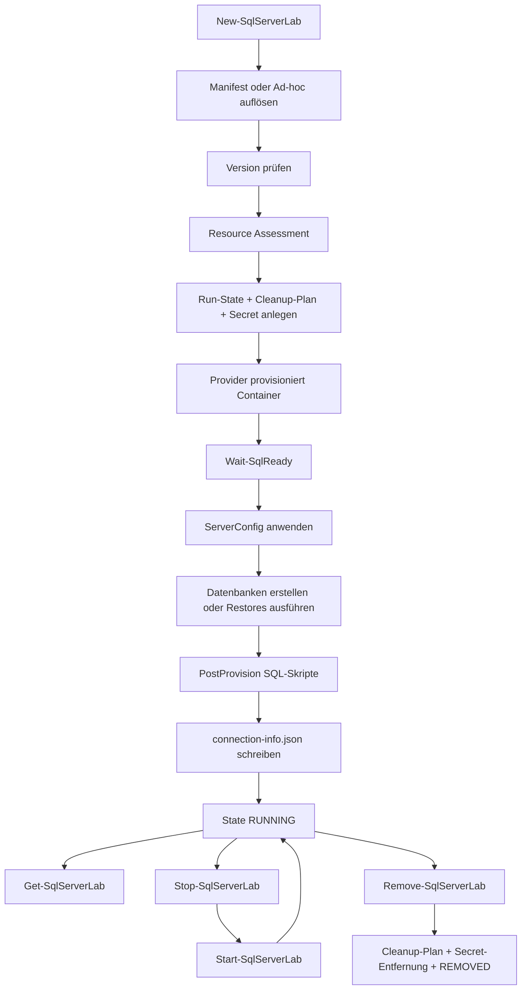

# Deep Research und README-Revision für SQL_Server_Lab

## Executive Summary

**Dokumentiert:** `SQL_Server_Lab` ist derzeit ein PowerShell-Modul für isolierte, reproduzierbare SQL-Server-Testumgebungen mit einem lauffähigen Kern für Docker und Podman, deklarativen JSON-Manifests, lokalem State/Cleanup, Datenbank-Erstellung, Skriptausführung und Restore aus Backups. Das Modul verlangt PowerShell 7.2, lädt `Private/`, `Public/` und `Providers/` rekursiv per Dot-Sourcing und exportiert seine Oberfläche über `SqlServerLab.psd1`. Die aktuelle Modulversion ist `0.1.0`. citeturn41view0turn8view0turn8view1

**Empirisch:** Die bestehende Root-`README.md` beschreibt vor allem Zweck, Architekturprinzipien und Lizenz, aber kaum die tatsächlich sofort nutzbare Oberfläche. Es fehlen oder sind zu wenig konkret: Voraussetzungen, Installation, konkrete Cmdlet-Referenz, Eingabe-/Ausgabeformate, Beispiel-Manifeste, lokale State-Dateien, Tests, bekannte Einschränkungen und der reale Implementierungsstand einzelner Provider. Für Menschen ist die README dadurch zu abstrakt; für KI-Analysen ist sie zu wenig operativ und zu wenig dateipfad-/formatorientiert. citeturn40view0turn18view0turn23view0turn23view1turn35view0

**Kritisch:** Die aktuelle README überzeichnet den Reifegrad von Hyper-V. Im Code akzeptiert `New-SqlServerLab` zwar `hyperv` als Provider-Wert, die tatsächliche Provisionierungslogik implementiert aber nur `docker` und `podman`; alles andere endet in `Provider '<name>' nicht implementiert.` Gleichzeitig dokumentiert `Providers/HyperV/README.md` Hyper-V ausdrücklich als „geplant“. citeturn14view0turn25view1

**Kritisch:** Die aktuelle README suggeriert eine menügeführte Auswahl für CPU, RAM, Storage, Ports und Persistenz. Das interaktive Cmdlet `Invoke-SqlServerLab` fragt in der derzeitigen Implementierung jedoch nur Provider und Version ab; Profile, Ports, Manifeste, Storage-Layouts und Server-Konfigurationen sind vor allem über direkte Cmdlet-Parameter bzw. JSON-Manifeste zugänglich. citeturn40view0turn16view0

**Empfohlen:** Die Root-README sollte von einer Architektur-/Vision-README zu einer operativen Produkt-README umgebaut werden: Was ist heute implementiert, wie wird es installiert, welche Eingaben gibt es, welche Outputs entstehen lokal, welche Cmdlets existieren, wie sehen Minimalbeispiele aus, welche Provider sind stabil, was ist geplant, welche Risiken und Grenzen gelten. Genau dafür ist der vollständige Entwurf weiter unten ausgearbeitet. citeturn41view0turn18view0turn23view1turn35view0

## Repository-Befund

Der Default-Branch ist `main`. Im Root liegen das Modulmanifest `SqlServerLab.psd1`, der Loader `SqlServerLab.psm1`, Kataloge (`Catalogs/`), interne Hilfsbausteine (`Private/`), öffentliche Cmdlets (`Public/`), Provider (`Providers/`), Manifest-/Beispieldateien (`Schemas/`), Integrationstests (`Tests/`) sowie umfangreiche Planungs- und Architekturtexte unter `Documentation/`. Zusätzlich existieren `.vscode/settings.json` für lokale JSON-Schema-Zuordnung und `.ai/`-Dokumente als KI-/Agentenkontext. Im gesichteten Tree erscheinen dagegen keine projekt-eigenen Dockerfiles, keine `.github/workflows` und keine Notebooks. citeturn1view0turn12view1turn23view0turn23view1turn23view2turn23view3turn41view1

Der Loader `SqlServerLab.psm1` durchsucht beim Modulimport rekursiv `Private/**/*.ps1`, `Public/**/*.ps1` und `Providers/**/*.ps1`, dot-sourced die Dateien in dieser Reihenfolge und exportiert anschließend exakt die in `SqlServerLab.psd1` gelisteten Funktionsnamen. Damit ist die öffentliche Oberfläche nicht nur auf `Public/*.ps1` beschränkt; auch intern definierte Funktionen können über das Manifest exportiert werden. citeturn8view0turn8view1turn41view0

Die heute konkret exportierte Oberfläche umfasst laut Modulmanifest fünfzehn Namen: `Invoke-SqlServerLab`, `New-SqlServerLab`, `Get-SqlServerLab`, `Start-SqlServerLab`, `Stop-SqlServerLab`, `Restart-SqlServerLab`, `Remove-SqlServerLab`, `Clear-SqlServerLab`, `New-LabDatabase`, `Invoke-LabScript`, `Restore-LabDatabase`, `Install-LabSoftware`, `Test-LabResources`, `Invoke-LabCleanup` und `Invoke-LabRecovery`. Im `Public/`-Ordner existieren dafür aber nur elf dedizierte Entry-Point-Dateien; `Test-LabResources` wird im Integrationstest direkt aufgerufen und stammt aus `Private/ResourceAssessment.ps1`, während für `Install-LabSoftware`, `Invoke-LabCleanup` und `Invoke-LabRecovery` im gesichteten Baum keine entsprechenden Public-Dateien auftauchen. Diese Diskrepanz sollte die README explizit erklären. citeturn41view0turn18view0turn23view0turn37view0

Funktional ist der Kern des Projekts klar: `New-SqlServerLab` löst Ad-hoc- oder Manifest-Eingaben auf, prüft SQL-Versionen, führt Resource Assessment aus, initialisiert lokalen Run-State, speichert ein SA-Secret, provisioniert Docker- oder Podman-Instanzen, wartet auf SQL-Bereitschaft, wendet optionale `serverConfig`-Einstellungen an, erstellt Datenbanken, führt optional Restores aus, verarbeitet Post-Provision-Skripte und schreibt `connection-info.json` als Laufzeit-Output. Im Fehlerfall setzt das Cmdlet State-Transitions und versucht ein automatisches Cleanup über den vorbereiteten Cleanup-Plan. citeturn14view0turn15view0

Die Eingabeformate sind ebenfalls klar ersichtlich. Unterstützt werden mindestens:
`New-SqlServerLab -Version/-Provider/-Profile/-Port/-InstanceId` für Ad-hoc-Labs, JSON-Manifeste gemäß `Schemas/lab-manifest.schema.json`, SQL-Dateien für `Invoke-LabScript`, lokale `.bak`-Pfade oder HTTP(S)-URLs für `Restore-LabDatabase` sowie Katalogreferenzen für Versionen und Beispiel-Datenbanken. Als Outputs entstehen PowerShell-Objekte, lokale State-Dateien unter dem StateRoot, `connection-info.json`, ein Secret-Ablagepfad, Cleanup-Plan-Dateien und ein Backup-Cache unter `<StateRoot>/cache/backups`. citeturn14view0turn17view1turn20view2turn22view4turn31view0turn31view1turn31view2

Die deklarative Schicht ist für Automatisierung und KI-Analyse ausgesprochen wertvoll. Das JSON-Schema deckt Instanzen, Versionen, Provider, Profile, `databases`, `postProvision`, `serverConfig`, `drives`, `resourceOverrides`, `restore` und `sample`-Referenzen ab. Die Beispielmanifeste illustrieren einfache Labs, Performance-Labs mit separaten Volumes und TempDB-Tuning, ein ML-/Extensibility-Szenario mit R/Python/Java, ein Performance-Tuning-Lab auf Basis eines StackOverflow-Samples und ein Restore-Szenario per URL. VS Code bindet das Schema automatisch für `Schemas/*.json` ein. citeturn32view0turn32view1turn32view4turn33view0turn33view1turn33view2turn33view3turn33view4turn41view1

Die Versionierung und die Sample-Datenbankkataloge sind ebenfalls schon belastbar: `Catalogs/sql-server-versions.json` enthält 2019, 2022 und 2025, Docker-Images, Build-/CU-Metadaten sowie Ressourcenprofile (`compact`, `standard`, `performance`). `Catalogs/sample-databases.json` beschreibt öffentlich referenzierbare Datensätze wie AdventureWorks, WideWorldImporters, StackOverflow 2013 und Northwind samt URLs, Größen, Kompatibilitätsständen und Cache-Policy. Das ist eine Stärke des Repos, die in der aktuellen Root-README kaum operationalisiert wird. citeturn31view0turn31view1turn34view0

Die Testschicht besteht derzeit primär aus einem lokalen End-to-End-Smoke-Test `Tests/Integration/Invoke-SmokeTest.ps1`. Er prüft T1–T9: Modulimport, Providernachweise, Resource Assessment, Lab-Erstellung, Datenbank-Erstellung, SQL-Skriptausführung mit `GO`-Batches, Statusabfrage, Stop, Start und Remove. `Tests/Static/` ist dagegen nur als geplant ausgewiesen. Eine CI/CD-Automatisierung ist im gesichteten Tree nicht sichtbar. citeturn35view0turn35view1turn37view0turn38view0



## Abdeckungsprüfung der bestehenden README

Die bestehende Root-`README.md` deckt Lizenzhinweise, Projektzweck, Architekturprinzipien, Daten-/Backup-Grenzen, Zielplattformen und Planungsdokumente gut ab. Sie dokumentiert aber nicht sauber, **wie** ein Entwickler oder eine KI das Modul heute tatsächlich benutzt. Für eine operative README fehlen besonders die konkrete PowerShell-Oberfläche, die Manifestformate, lokale Seiteneffekte und der reale Reifegrad des Codes. citeturn40view0turn41view0turn18view0turn23view1

| Prüfkriterium | Status im aktuellen README | Bewertung |
|---|---|---|
| Projektübersicht | vorhanden | inhaltlich stark, aber stärker visionär als operativ citeturn40view0 |
| Voraussetzungen | praktisch fehlend | PowerShell 7.2, Container-Runtime, `sqlcmd`, Host-Anforderungen fehlen als klare Checkliste citeturn41view0turn20view2turn35view0 |
| Installation | fehlend | kein Modulimport, kein Setup, kein Quickstart citeturn40view0 |
| Konfiguration | teilweise | Architektur erwähnt Konfiguration, aber keine konkrete Manifest- oder Parameterdokumentation citeturn40view0turn31view2 |
| Nutzung / Beispiele | weitgehend fehlend | keine minimal reproduzierbaren Cmdlet-Beispiele im Root, Beispiele liegen nur unter `Schemas/` citeturn40view0turn33view0turn33view1turn33view4 |
| API/CLI-Befehle | fehlend | keine systematische Cmdlet-Referenz im Root README citeturn40view0turn41view0 |
| Eingabe-/Ausgabeformate | fehlend | JSON-Manifeste, SQL-Dateien, `.bak`, Return-Objekte, `connection-info.json` nicht erklärt citeturn14view0turn17view1turn20view2turn31view2 |
| Tests | fehlend | Smoke-Test existiert, wird im Root README aber nicht operativ erklärt citeturn35view0turn37view0 |
| Beitragende | fehlend | keine Contribution-Hinweise, obwohl viele Planungs-/Architekturdateien existieren citeturn12view1 |
| Lizenz | vorhanden | gut sichtbar, aber sehr dominant gegenüber der Nutzungsdokumentation citeturn40view0turn39view0 |
| Bekannte Einschränkungen | teilweise / irreführend | Hyper-V wird als Kernprovider gerahmt, ist aber aktuell geplant; Menüumfang wird überschätzt citeturn40view0turn25view1turn16view0turn15view0 |
| Sicherheitsaspekte | teilweise | Lizenz/Isolationsprinzip da, aber praktische Security-Hinweise zu Secrets, Pfaden, Backups und lokalen State-Dateien fehlen citeturn40view0turn23view0turn14view0turn22view4 |

Die gravierendsten Deltas zwischen Dokumentation und implementiertem Stand sind drei Punkte. Erstens: Hyper-V ist konzeptionell beschrieben, aber nicht produktiv implementiert. Zweitens: die interaktive Oberfläche ist enger als die README suggeriert. Drittens: die öffentliche Funktionsoberfläche wird im Root nicht als echte Befehlsreferenz erklärt, obwohl der Code bereits eine klare Cmdlet-Struktur bietet. citeturn25view1turn15view0turn16view0turn41view0

## Datei- und Modulmatrix

Die folgende Matrix fokussiert die für Ausführung, Analyse, Erweiterung und README-Dokumentation relevanten Dateien und Module des gesichteten Repos. Sie ersetzt nicht die Feindokumentation in `Documentation/`, zeigt aber die operative Oberfläche und die wichtigsten Vertragsdateien. citeturn1view0turn12view1turn23view0turn23view1turn23view2turn35view0

| Pfad | Zweck | Hauptfunktionen | Abhängigkeiten | Ausführungsbeispiel | Beleg |
|---|---|---|---|---|---|
| `README.md` | aktuelle Root-Dokumentation | Vision, Lizenz, Architektur, Scope | – | – | citeturn40view0 |
| `SqlServerLab.psd1` | Modulmanifest | Exportliste, Version, Tags, PS-Minimum | PowerShell 7.2 | `Import-Module .\SqlServerLab.psd1 -Force` | citeturn41view0 |
| `SqlServerLab.psm1` | Modul-Loader | dot-sourcing von `Private/`, `Public/`, `Providers/`; Export | Dateibaum | automatisch beim Import | citeturn8view0turn8view1 |
| `.vscode/settings.json` | IDE-Schema-Mapping | bindet `Schemas/*.json` an `lab-manifest.schema.json` | VS Code | JSON-Datei in `Schemas/` öffnen | citeturn41view1 |
| `.ai/PROJECT_CONTEXT.md` | KI-/Agentenkontext | Projektziel und Ausrichtung | – | – | citeturn10view0 |
| `.ai/WORKING_RULES.md` | KI-/Arbeitsregeln | Bearbeitungs- und Qualitätsregeln | – | – | citeturn10view0 |
| `Catalogs/sql-server-versions.json` | Versionskatalog | SQL 2019/2022/2025, Images, CU/Builds, Profile | JSON | indirekt über `New-SqlServerLab -Version 2022` | citeturn31view0 |
| `Catalogs/sample-databases.json` | Sample-Katalog | AdventureWorks, WWI, StackOverflow, Northwind, Cache-Policy | HTTP(S), Restore/Script | indirekt über Manifest-`sample`/Restore | citeturn31view1turn34view0 |
| `Private/Common.ps1` | Basishilfen | Logging, Eingaben, Runtime-Erkennung | PowerShell | intern | citeturn23view0 |
| `Private/StateMachine.ps1` | lokaler Run-State | `Get/Set/New/Add/Remove-LabRunState`, `Get-LabActiveRuns` | Dateisystem | intern | citeturn23view0 |
| `Private/ResourceAssessment.ps1` | Ressourcenprüfung | `Test-LabResources`, Provider-/RAM-Checks | Host-Ressourcen, Provider | `Test-LabResources -Provider docker` | citeturn23view0turn37view0 |
| `Private/SqlReadiness.ps1` | SQL-Bereitschaft & SQL-Ausführung | `Wait-SqlReady`, `Invoke-LabSqlScript` u. a. | SQL Server, vermutlich `sqlcmd`/SQL-Connectivity | intern | citeturn23view0turn14view0 |
| `Private/CleanupEngine.ps1` | Cleanup-Orchestrierung | Cleanup-Plan erzeugen/erweitern/ausführen | Dateisystem, Provider | intern | citeturn23view0turn20view0 |
| `Private/ManifestParser.ps1` | Manifest-Auflösung | Defaults, Provider-Autoselect, Database-Resolution | JSON | intern beim Manifest-Modus | citeturn23view0turn14view0 |
| `Private/ServerConfig.ps1` | Server-/DB-Konfiguration | `Set-LabServerConfig`, `Set-LabDatabaseOptions` | SQL Server | intern | citeturn23view0turn15view0 |
| `Private/SecretProvider.ps1` | Secret-Speicherung | Save/Get/Remove-LabSecret | lokaler Secret-Store, DPAPI auf Windows | intern | citeturn23view0turn14view0 |
| `Public/Invoke-SqlServerLab.ps1` | interaktive Oberfläche | Menü, Provider-Erkennung, Dispatch | Modulimport, lokale Eingabe | `Invoke-SqlServerLab` | citeturn16view0turn17view0 |
| `Public/New-SqlServerLab.ps1` | wichtigste Provisionierungsfunktion | Ad-hoc/Manifest, Assessment, Provisionierung, DB, Restore, PostProvision | Provider, State, SQL, Secrets | `New-SqlServerLab -Version 2025 -Provider docker` | citeturn14view0turn15view0 |
| `Public/Get-SqlServerLab.ps1` | Statusabruf | State + Live-Containerstatus | lokaler State, Container-Runtime | `Get-SqlServerLab -RunId <GUID>` | citeturn17view3turn22view2 |
| `Public/Stop-SqlServerLab.ps1` | Stoppen | graceful stop, State `STOPPED` | Docker/Podman | `Stop-SqlServerLab -RunId <GUID> -Force` | citeturn21view1 |
| `Public/Start-SqlServerLab.ps1` | Starten | Containerstart, optional Readiness, State `RUNNING` | Docker/Podman, Secrets | `Start-SqlServerLab -RunId <GUID>` | citeturn21view0turn22view0 |
| `Public/Restart-SqlServerLab.ps1` | Neustart | Stop + Start | obige Cmdlets | `Restart-SqlServerLab -RunId <GUID>` | citeturn20view1 |
| `Public/Remove-SqlServerLab.ps1` | Entfernen | Cleanup-Plan, Secret-Löschung, State `REMOVED` | lokaler State, Cleanup, Provider | `Remove-SqlServerLab -RunId <GUID> -Force` | citeturn20view0 |
| `Public/Clear-SqlServerLab.ps1` | globales Aufräumen | findet Orphans, bereinigt State/Container global | Container-Runtime, State | `Clear-SqlServerLab -Force` | citeturn17view4turn22view3 |
| `Public/New-LabDatabase.ps1` | DB-Erstellung | `CREATE DATABASE` mit Multi-File, Optionen | SQL-Verbindung | `New-LabDatabase -Port 14330 -SaPassword $pw -DatabaseName TestDB` | citeturn17view2 |
| `Public/Invoke-LabScript.ps1` | SQL-Skriptausführung | Pfad/RunId-Modus, DB-Wahl, `GO`-Batches | SQL-Skript, Verbindung | `Invoke-LabScript -ScriptPath .\setup.sql -RunId <GUID>` | citeturn17view1turn22view1 |
| `Public/Restore-LabDatabase.ps1` | DB-Restore | URL/Datei, Container-Copy, `FILELISTONLY`, `WITH MOVE`, Cache | `sqlcmd`, HTTP(S), Container-Runtime | `Restore-LabDatabase -Port 14330 -BackupSource https://...` | citeturn20view2turn21view2turn22view4 |
| `Providers/Docker/DockerProvider.ps1` | Docker-Provider | Availability, Portsuche, Run/Status/Start/Stop/Remove/List | `docker` CLI | indirekt via `-Provider docker` | citeturn27view0 |
| `Providers/Docker/provider.json` | Docker-Metadaten | Capabilities, Limits, Portbereich, Labels | JSON | – | citeturn28view0 |
| `Providers/Podman/PodmanProvider.ps1` | Podman-Provider | Availability, Portsuche, Run/Status/Lifecycle | `podman` CLI, ggf. `podman machine` | indirekt via `-Provider podman` | citeturn28view2turn29view0 |
| `Providers/Podman/provider.json` | Podman-Metadaten | Portbereich, Requirements, Notes | JSON | – | citeturn28view1 |
| `Providers/HyperV/README.md` | Hyper-V-Status | geplantes Interface, Windows-Szenarien | Hyper-V | – | citeturn25view1 |
| `Schemas/lab-manifest.schema.json` | zentrales Eingabeschema | Instanzen, DBs, Restore, Samples, ServerConfig, Drives | JSON Schema Draft-07 | Manifestvalidierung in IDE | citeturn31view2turn32view0turn32view1turn32view4 |
| `Schemas/example-lab.json` | Minimalbeispiel | 1 Instanz, 1 DB, PostProvision | Docker, Manifest | `New-SqlServerLab -Manifest .\Schemas\example-lab.json` | citeturn33view0 |
| `Schemas/example-performance-lab.json` | Performancebeispiel | Drives, TempDB, ServerConfig, Multi-File-DB | Docker, Manifest | `New-SqlServerLab -Manifest .\Schemas\example-performance-lab.json` | citeturn33view1 |
| `Schemas/example-ml-services.json` | ML-/Extensibility-Beispiel | External Languages, Sample-DB, PostProvision | Docker, Manifest | `New-SqlServerLab -Manifest .\Schemas\example-ml-services.json` | citeturn33view2 |
| `Schemas/example-performance-tuning.json` | großes Performance-Lab | StackOverflow-Sample, TempDB, Query Store | Docker, Manifest | `New-SqlServerLab -Manifest .\Schemas\example-performance-tuning.json` | citeturn33view3 |
| `Schemas/example-restore-lab.json` | Restore-Minimalbeispiel | Restore per URL | HTTP(S), Manifest | `New-SqlServerLab -Manifest .\Schemas\example-restore-lab.json` | citeturn33view4 |
| `Tests/Integration/Invoke-SmokeTest.ps1` | lokaler E2E-Test | T1–T9 über gesamten Lifecycle | PowerShell 7.2, Docker/Podman, Modul | `.\Tests\Integration\Invoke-SmokeTest.ps1` | citeturn37view0turn38view0 |
| `Tests/Static/` | statische Analyse | derzeit geplant | – | – | citeturn35view1 |
| `Documentation/**` | Projektplanung/Verträge | Architektur, Migration, Qualität, Standards, Research | – | Referenz für Entwurfs-/Governance-Themen | citeturn12view1turn23view4 |

## Vollständiger README.md-Entwurf

Der folgende Entwurf ist auf den tatsächlichen derzeit sichtbaren Implementierungsstand zugeschnitten: Docker und Podman sind als Kernpfad dokumentiert, Hyper-V wird als geplant markiert, die Cmdlets sind konkret aufgeführt, Ein- und Ausgaben sind benannt, und die README ist sowohl für Entwickler als auch für automatisierte Analyse geeignet. Die Aussagen basieren auf den oben belegten Repo-Befunden. citeturn41view0turn14view0turn18view0turn23view1turn35view0

```markdown
# SQL Server Lab

> Isolierte, reproduzierbare SQL-Server-Testumgebungen als PowerShell-Modul mit Docker-/Podman-Providern, deklarativen JSON-Manifests, lokalem Run-State und Cleanup-Orchestrierung.

## Lizenzhinweis

**Wichtig:** Dieses Repository ist **nicht Open Source**. Es gilt eine benutzerdefinierte Attribution-&-Non-Commercial-Redistribution-Lizenz.  
Vor Nutzung, Weitergabe oder Einbindung bitte **`LICENCE.md`** vollständig lesen.

Kurzfassung:
- Nutzung ist erlaubt.
- Kommerzielle Weitergabe / Resale ist untersagt.
- Urheberangabe ist verpflichtend.
- Rechte an SQL Server, Docker, Podman, Hyper-V, Windows oder anderer Drittsoftware werden **nicht** mitlizenziert.

## Projektüberblick

`SQL_Server_Lab` ist ein PowerShell-Modul für reproduzierbare SQL-Server-Testumgebungen.

Der aktuelle Implementierungsstand fokussiert auf:

- **Docker** als primären Provider
- **Podman** als kompatible Alternative
- **JSON-Manifeste** für deklarative Lab-Definitionen
- **lokalen Run-State** mit Cleanup-Plan
- **Datenbank-Erstellung**
- **SQL-Skriptausführung**
- **Datenbank-Restore** aus lokaler Datei oder URL
- **Post-Provision-Skripte**
- **Versionen 2019 / 2022 / 2025** über Katalog

**Nicht produktiv implementiert:** Hyper-V ist im Repository architektonisch vorbereitet, aber im aktuellen Codepfad noch **geplant**.

## Aktueller Funktionsumfang

### Kernfunktionen

- neue SQL-Server-Lab-Umgebung erstellen
- Labs starten, stoppen, neu starten und entfernen
- alle Lab-Ressourcen global bereinigen
- Lab-Status aus lokalem State + Live-Containerstatus lesen
- Datenbanken mit Dateilayout und Optionen anlegen
- T-SQL-Skripte mit `GO`-Batch-Splitting ausführen
- `.bak`-Backups wiederherstellen
- SQL-Server-Konfiguration aus Manifest anwenden
- Post-Provision-Skripte automatisch ausführen
- Beispiel-Labs und JSON-Schema in `Schemas/`

### Provider-Status

| Provider | Status | Bemerkung |
|---|---|---|
| Docker | produktiv | Primärer Ausführungspfad |
| Podman | produktiv | Rootless-kompatibler Alternativpfad |
| Hyper-V | geplant | Noch nicht im Provisionierungs-Switch implementiert |

## Voraussetzungen

### Minimal

- **PowerShell 7.2 oder neuer**
- **Docker** oder **Podman**
- Netzwerkzugriff zum Ziehen von Container-Images
- ausreichende lokale Ressourcen für SQL Server

### Für Restore- und manche SQL-Operationen

- `sqlcmd` lokal verfügbar
- Zugriff auf lokale `.bak`-Dateien oder HTTP(S)-URLs
- Schreibrechte im lokalen StateRoot

### Für Entwicklung / Manifest-Arbeit

- empfohlen: **VS Code**
- JSON-Schema-Zuordnung ist in `.vscode/settings.json` bereits vorbereitet

## Installation

### Repository klonen

```powershell
git clone https://github.com/gecompat/SQL_Server_Lab.git
cd SQL_Server_Lab
```

### Modul importieren

```powershell
Import-Module .\SqlServerLab.psd1 -Force
Get-Command -Module SqlServerLab
```

## Quickstart

### Interaktives Menü

```powershell
Import-Module .\SqlServerLab.psd1 -Force
Invoke-SqlServerLab
```

### Direkt ein Lab erzeugen

```powershell
Import-Module .\SqlServerLab.psd1 -Force
$pw = Read-Host "SA Password" -AsSecureString

$lab = New-SqlServerLab `
  -Version 2025 `
  -Provider docker `
  -Profile standard `
  -SaPassword $pw
```

### Status lesen

```powershell
Get-SqlServerLab
Get-SqlServerLab -RunId $lab.RunId -Detailed
```

### Wieder stoppen / starten / entfernen

```powershell
Stop-SqlServerLab -RunId $lab.RunId -Force
Start-SqlServerLab -RunId $lab.RunId
Restart-SqlServerLab -RunId $lab.RunId -Force
Remove-SqlServerLab -RunId $lab.RunId -Force
```

## Öffentliche Cmdlets

### `Invoke-SqlServerLab`

Interaktive Oberfläche mit Menü-Loop.  
Eignet sich für manuelle Bedienung und schnelle lokale Tests.

```powershell
Invoke-SqlServerLab
Invoke-SqlServerLab -Action Status
```

Direktaktionen:

- `New`
- `Status`
- `Stop`
- `Start`
- `Restart`
- `Remove`
- `Clear`
- `Script`
- `Database`

### `New-SqlServerLab`

Erstellt eine neue SQL-Server-Testumgebung.

#### Modus A: Ad-hoc

```powershell
$lab = New-SqlServerLab `
  -Version 2022 `
  -Provider docker `
  -Profile compact `
  -Port 14330 `
  -InstanceId primary `
  -SaPassword $pw
```

#### Modus B: Manifest

```powershell
$lab = New-SqlServerLab `
  -Manifest .\Schemas\example-lab.json `
  -SaPassword $pw
```

#### Parameter

| Parameter | Typ | Beschreibung |
|---|---|---|
| `-Version` | `string` | SQL-Version oder Katalog-ID, z. B. `2019`, `2022`, `2025` |
| `-Provider` | `string` | `docker`, `podman`, `hyperv` |
| `-Profile` | `string` | `compact`, `standard`, `performance` |
| `-Port` | `int` | externer SQL-Port; `0` = automatisch |
| `-InstanceId` | `string` | logische Instanz-ID |
| `-Manifest` | `string` | Pfad zu Manifest-JSON |
| `-SaPassword` | `SecureString` | SA-Passwort |
| `-StateRoot` | `string` | alternativer lokaler State-Pfad |
| `-SkipAssessment` | `switch` | Ressourcenprüfung überspringen |

#### Rückgabe

`PSCustomObject` mit mindestens:

- `RunId`
- `ScopeId`
- `State`
- `Name`
- `Instances`
- `StateRoot`

### `Get-SqlServerLab`

Liest den Status eines oder aller Labs aus lokalem Run-State und Container-Livezustand.

```powershell
Get-SqlServerLab
Get-SqlServerLab -RunId $lab.RunId
Get-SqlServerLab -RunId $lab.RunId -Detailed
```

### `Stop-SqlServerLab`

Stoppt laufende Container einer Umgebung graceful und setzt den State auf `STOPPED`.

```powershell
Stop-SqlServerLab -RunId $lab.RunId -Force
```

### `Start-SqlServerLab`

Startet gestoppte Container einer Umgebung und prüft optional SQL-Bereitschaft.

```powershell
Start-SqlServerLab -RunId $lab.RunId
Start-SqlServerLab -RunId $lab.RunId -SkipReadyCheck
```

### `Restart-SqlServerLab`

Bequemer Stop+Start-Wrapper.

```powershell
Restart-SqlServerLab -RunId $lab.RunId -Force
```

### `Remove-SqlServerLab`

Führt den Cleanup-Plan aus, entfernt Secrets und finalisiert den State mit `REMOVED`.

```powershell
Remove-SqlServerLab -RunId $lab.RunId -Force
```

### `Clear-SqlServerLab`

Globale Bereinigung aller Lab-Container und/oder verwaister State-Einträge.

```powershell
Clear-SqlServerLab
Clear-SqlServerLab -Force
Clear-SqlServerLab -StateOnly
Clear-SqlServerLab -ContainersOnly
```

### `New-LabDatabase`

Erzeugt eine Datenbank mit Data-/Log-Dateien und Optionen.

```powershell
New-LabDatabase `
  -Port 14330 `
  -SaPassword $pw `
  -DatabaseName TestDB `
  -DataFiles @(
    @{ name = 'TestDB_Data1'; sizeMB = 128; filegrowthMB = 64 },
    @{ name = 'TestDB_Data2'; sizeMB = 128; filegrowthMB = 64 }
  ) `
  -LogFiles @(
    @{ name = 'TestDB_Log'; sizeMB = 64; filegrowthMB = 64 }
  )
```

### `Invoke-LabScript`

Führt T-SQL gegen eine Lab-Instanz aus. Unterstützt direkten Host/Port-Modus oder `RunId`-Auflösung.

```powershell
Invoke-LabScript `
  -ScriptPath .\setup.sql `
  -Port 14330 `
  -SaPassword $pw `
  -Database master
```

```powershell
Invoke-LabScript `
  -ScriptPath .\setup.sql `
  -RunId $lab.RunId `
  -InstanceId primary `
  -SaPassword $pw `
  -Database SchulungsDB
```

### `Restore-LabDatabase`

Stellt eine DB aus Backup wieder her. Unterstützt:

- URL
- lokalen Dateipfad
- Kopie in den Container
- `RESTORE FILELISTONLY`
- `WITH MOVE`
- optional `WITH REPLACE`

```powershell
Restore-LabDatabase `
  -Port 14330 `
  -SaPassword $pw `
  -BackupSource "https://github.com/Microsoft/sql-server-samples/releases/download/adventureworks/AdventureWorks2022.bak" `
  -DatabaseName AdventureWorks `
  -ContainerName sql-lab-primary-12345678 `
  -Replace
```

## Eingabeformate

### JSON-Manifest

Das zentrale Eingabeformat ist `Schemas/lab-manifest.schema.json`.

Wichtige Felder:

- `name`
- `description`
- `instances[]`
  - `id`
  - `version`
  - `provider`
  - `profile`
  - `collation`
  - `drives[]`
  - `serverConfig`
  - `databases[]`
  - `postProvision[]`
- `resourceOverrides`

#### Minimalbeispiel

```json
{
  "$schema": "./Schemas/lab-manifest.schema.json",
  "name": "example-schulung-lab",
  "instances": [
    {
      "id": "primary",
      "version": "2025",
      "provider": "docker",
      "profile": "compact",
      "databases": [
        {
          "name": "SchulungsDB"
        }
      ],
      "postProvision": [
        "setup-schulung.sql"
      ]
    }
  ]
}
```

### Datenbankdefinitionen im Manifest

Unterstützte Muster:

- CREATE DATABASE mit Filelayout
- DB-Optionen wie Query Store, Recovery Model, RCSI, Compatibility Level
- Restore über `restore.source`
- sample-basierte Referenz über `sample.id` / `sample.variant`

### SQL-Dateien

`Invoke-LabScript` verarbeitet `.sql`-Dateien und trennt `GO`-Batches korrekt.

### Backup-Quellen

`Restore-LabDatabase` unterstützt:

- `https://...`
- lokaler Dateipfad
- Container-Import mit anschließendem Restore

## Beispielmanifeste

Im Ordner `Schemas/` liegen mehrere Beispielkonfigurationen:

| Datei | Zweck |
|---|---|
| `example-lab.json` | minimales Lab mit DB + PostProvision |
| `example-restore-lab.json` | Restore einer Datenbank per URL |
| `example-performance-lab.json` | Performance-Lab mit separaten Volumes, TempDB und ServerConfig |
| `example-ml-services.json` | SQL + R/Python/Java / Extensibility |
| `example-performance-tuning.json` | Performance-Tuning-Lab mit großem Beispiel-Dataset |

## Kataloge

### SQL-Versionen

`Catalogs/sql-server-versions.json` enthält:

- unterstützte SQL-Server-Versionen
- Docker-Images
- Build-/CU-Metadaten
- Ressourcenprofile

### Beispiel-Datenbanken

`Catalogs/sample-databases.json` enthält Referenzen auf öffentlich verfügbare Beispieldatenbanken, z. B.:

- AdventureWorks
- WideWorldImporters
- StackOverflow
- Northwind

Wichtig:
- Im Repository liegen **keine** großen Backups.
- Es werden Metadaten, Quellen und Download-URLs beschrieben.

## Lokale Outputs und Seiteneffekte

Das Modul erzeugt lokale Laufzeitdaten im StateRoot.

Typische Artefakte:

- `runs/<RunId>/connection-info.json`
- Run-State-Dateien / State-History
- Cleanup-Plan
- lokal gespeicherte Secrets
- Backup-Cache unter `cache/backups/`

### Beispiel `connection-info.json`

```json
{
  "runId": "xxxxxxxx-xxxx-xxxx-xxxx-xxxxxxxxxxxx",
  "scopeId": "yyyyyyyy-yyyy-yyyy-yyyy-yyyyyyyyyyyy",
  "instances": [
    {
      "id": "primary",
      "host": "127.0.0.1",
      "port": 14330,
      "version": "2025",
      "provider": "docker",
      "connectionString": "Server=127.0.0.1,14330;User ID=sa;Password=***;",
      "databases": [
        "SchulungsDB"
      ]
    }
  ]
}
```

## Tests

### Smoke-Test

Der wichtigste aktuell vorhandene Test ist:

```powershell
Import-Module .\SqlServerLab.psd1 -Force
.\Tests\Integration\Invoke-SmokeTest.ps1
```

Optional:

```powershell
$pw = ConvertTo-SecureString 'SmokeTest_Pwd1!' -AsPlainText -Force
.\Tests\Integration\Invoke-SmokeTest.ps1 -SaPassword $pw -Version 2022 -Provider docker
```

Der Smoke-Test prüft:

1. Modulimport
2. Provider-Funktionen
3. Resource Assessment
4. `New-SqlServerLab`
5. `New-LabDatabase`
6. `Invoke-LabScript`
7. `Get-SqlServerLab`
8. `Stop-SqlServerLab`
9. `Start-SqlServerLab`
10. `Remove-SqlServerLab`

### Statische Tests

`Tests/Static/` ist aktuell als geplanter Bereich vorhanden, aber noch nicht ausgebaut.

## Sicherheits- und Betriebsaspekte

### Wichtige Hinweise

- Nur in **isolierten Testumgebungen** verwenden.
- Keine produktiven Daten oder produktiven Backups einbinden.
- Lokale State-/Secret-Bereiche nicht versionieren.
- Lab-Szenarien dürfen bewusst Last, Fehler oder destruktive Zustände erzeugen.
- Drittsoftware-Lizenzen und SQL-Server-Nutzungsrechte sind vom Nutzer sicherzustellen.

### Datenquellen

Erlaubt sind:

- im Lab erzeugte Artefakte
- öffentliche Beispieldatenbanken
- klar klassifizierte Entwicklungs-/Test-Backups

Nicht Ziel des Repos:

- produktive Daten
- unklassifizierte Backups
- undokumentierte Artefakte unbekannter Herkunft

## Bekannte Einschränkungen

- Hyper-V ist aktuell **noch nicht produktiv implementiert**
- keine sichtbare CI/CD-Pipeline im Repository
- `Tests/Static/` ist geplant, aber nicht ausgebaut
- einige über `SqlServerLab.psd1` exportierte Namen sind im Repo nicht als eigene Public-Entry-Point-Dateien vorhanden
- Provider-Metadaten und Implementierungsdateien sind nicht überall vollständig konsistent
- das interaktive Menü deckt weniger Optionen ab als die Manifest-Schicht

## Für Entwickler

### Relevante Verzeichnisse

| Pfad | Inhalt |
|---|---|
| `Public/` | exportierte Cmdlets |
| `Private/` | interne Hilfsfunktionen |
| `Providers/` | Docker-/Podman-/Hyper-V-Provider |
| `Schemas/` | JSON-Schema und Beispielmanifeste |
| `Catalogs/` | Versionen und Sample-Datenquellen |
| `Tests/` | Smoke-Test und künftige statische Tests |
| `Documentation/` | Architektur-, Qualitäts- und Planungsdokumente |

### Erweiterungsregeln

- neue öffentliche Cmdlets sauber dokumentieren
- Eingaben/Outputs mit Beispielen ergänzen
- Manifest-Schema und Beispielmanifeste synchron halten
- neue Provider nur dokumentieren, wenn sie im Provisionierungsfluss tatsächlich unterstützt werden
- neue Features idealerweise mit Integrationstest absichern

## Für KI-Analyse und Automatisierung

Die wichtigsten maschinenlesbaren Einstiegspunkte sind:

- `SqlServerLab.psd1` – exportierte Funktionen
- `SqlServerLab.psm1` – Loader und Modulstruktur
- `Schemas/lab-manifest.schema.json` – deklaratives Eingabeformat
- `Catalogs/sql-server-versions.json` – Versionskatalog
- `Catalogs/sample-databases.json` – Sample-Datenquellen
- `Tests/Integration/Invoke-SmokeTest.ps1` – realer End-to-End-Nutzungspfad

Empfohlene Analyse-Reihenfolge:

1. `SqlServerLab.psd1`
2. `SqlServerLab.psm1`
3. `Public/*.ps1`
4. `Private/*.ps1`
5. `Providers/**/*.ps1`
6. `Schemas/lab-manifest.schema.json`
7. `Schemas/example-*.json`
8. `Tests/Integration/Invoke-SmokeTest.ps1`

## Beitragshinweise

Bis eine formale `CONTRIBUTING.md` existiert, gelten praktisch:

- Änderungen am Funktionsumfang immer auch in README und Beispielen dokumentieren
- Manifest-Felder nie ohne Schema-Anpassung erweitern
- neue Provider nur mit dokumentierten Capabilities, Limits und Lifecycle-Funktionen aufnehmen
- Tests vor Merge lokal ausführen

## Verwandte Inhalte

Dieses Repository ergänzt insbesondere:

- `gecompat/SQL_Server_Analyze`
- `gecompat/SQL_PerformanceSchulung`

## Status

**Repository-Stand:** frühe, aber bereits lauffähige Modulbasis auf PowerShell- und Container-Ebene.  
**Produktiv nutzbarer Schwerpunkt:** Docker / Podman / deklarative SQL-Labs.  
**Noch im Ausbau:** Hyper-V, statische Analyse, stärkere Entwicklerdokumentation, CI/CD.
```

## Priorisierte Änderungsmaßnahmen

### Kritisch

Die Root-README sollte den **Implementierungsstand von Hyper-V** klar als „geplant“ markieren. Alles andere ist für Nutzer und für KI-Analyse potentiell irreführend, weil der aktuelle Provisionierungspfad nur Docker und Podman implementiert. citeturn15view0turn25view1

Die README sollte die **tatsächlich nutzbaren Cmdlets** samt Minimalbeispielen an die Spitze holen. Im Code ist die Oberfläche bereits greifbar und stabil genug dokumentierbar: Provisionierung, Status, Stop/Start/Restart/Remove, Cleanup, DB-Erstellung, SQL-Skriptausführung und Restore. Die bestehende README blendet genau diese konkrete Nutzbarkeit fast vollständig aus. citeturn41view0turn18view0turn14view0turn17view1turn20view2

Die README sollte einen eigenen Abschnitt **„Inputs, Outputs und lokale Artefakte“** enthalten. Für eine KI ist das besonders wichtig: Welche Dateien gehen hinein (`manifest.json`, `.sql`, `.bak`), welche entstehen lokal (`connection-info.json`, State, Secrets, Cache), wo liegen sie, und wofür dienen sie. Der Code produziert diese Artefakte schon jetzt sehr deutlich. citeturn14view0turn15view0turn22view4

### Empfohlen

Es sollte eine **explizite Diskrepanzliste** eingeführt werden: „im Manifest exportiert“, „als Public-Entry-Point vorhanden“, „geplant“, „nur intern“. Das löst die derzeitige Unschärfe um `Test-LabResources`, `Install-LabSoftware`, `Invoke-LabCleanup` und `Invoke-LabRecovery`. citeturn41view0turn18view0turn23view0turn37view0

Die README sollte **`sqlcmd` als praktische Voraussetzung** benennen. Restore und Testpfad verlassen sich erkennbar darauf; ohne diesen Hinweis entstehen unnötige Fehlstarts. citeturn20view2turn37view0

Für Entwickler und KI-Analyse sollten die **wichtigsten Pfade** explizit genannt werden: `SqlServerLab.psd1`, `SqlServerLab.psm1`, `Public/`, `Private/`, `Providers/`, `Schemas/`, `Catalogs/`, `Tests/Integration/Invoke-SmokeTest.ps1`. Die Informationen sind vorhanden, aber derzeit stark über Unter-README-Dateien und Planungsdokumente verteilt. citeturn41view0turn23view0turn23view1turn23view2turn35view0

### Optional

Eine `CONTRIBUTING.md` wäre sinnvoll, um Dokumentationsregeln, Schema-Synchronisation und lokale Testpflichten festzuhalten. Das Repo enthält bereits viel Governance in `Documentation/`, aber keinen kompakten Beitragspfad im Root. citeturn12view1turn23view4

Eine kleine `docs/faq.md` oder ein README-Abschnitt **„Troubleshooting“** wäre nützlich: Container-Runtime nicht gefunden, `podman machine` nicht gestartet, `sqlcmd` fehlt, Portbereich belegt, Download/Restore schlägt fehl, Cleanup nach Abbruch. Viele dieser Fälle sind aus dem Code ableitbar. citeturn28view2turn29view0turn20view2turn17view4

Eine CI-Pipeline für wenigstens Modulimport, Schema-Validierung und Smoke-Test auf einer unterstützten Runtime wäre mittelfristig sehr wertvoll. Im gesichteten Tree fehlt derzeit eine entsprechende Automation. citeturn1view0turn35view0turn35view1

## Konkrete Unklarheiten und Ergänzungsvorschläge im Repo

**Kritisch:** `Providers/Docker/provider.json` verweist auf `"module": "DockerProvider.psm1"`, im Tree liegt aber `DockerProvider.ps1`, und die Provider-README erklärt ausdrücklich, dass die Implementierungsdatei `.ps1` sein soll, damit Dot-Sourcing korrekt funktioniert. Das ist eine echte Konsistenzlücke und sollte entweder im JSON oder in der Dateibenennung korrigiert werden. citeturn28view0turn24view0turn27view0

**Kritisch:** Der Integrationstest ist nicht vollständig provider-neutral. Obwohl der Test den Provider grundsätzlich dynamisch erkennt, werden bei den Verifikationsschritten für Stop/Start `docker inspect`-Aufrufe hartcodiert verwendet. Das macht den Smoke-Test im Podman-Pfad inkonsistent. Diese Stellen sollten auf `$script:ContainerRuntime inspect ...` umgestellt werden. citeturn37view0turn38view0

**Empirisch:** Die `Public/README.md` ist in Teilen selbst inkonsistent. Sie listet `Test-LabResources` unter „Noch nicht implementiert“, obwohl genau dieses Cmdlet im Integrationstest erfolgreich direkt verwendet wird und laut `Private/README.md` in `ResourceAssessment.ps1` definiert ist. Die Dokumentation sollte hier zwischen „kein eigenes Public-Datei-Entry-Point“ und „trotzdem exportiert und verfügbar“ unterscheiden. citeturn18view0turn23view0turn37view0

**Vermutung auf Basis der Repo-Struktur:** Die sample-basierte Manifest-Nutzung (`database.sample`) dürfte im Manifest-Parsing in konkrete Quellen aufgelöst werden, weil das Schema und mehrere Beispielmanifeste diese Form bereits vorsehen, während `New-SqlServerLab` selbst nur mit bereits aufgelösten Datenbankobjekten arbeitet. Diese Auflösung sollte in README oder in `ManifestParser.ps1` mit mindestens einem Beispiel explizit kommentiert werden, damit KI-Analysen den Pfad sauber nachvollziehen können. citeturn31view2turn33view2turn33view3turn23view0

**Empfohlen:** Ergänze im Root eine kurze **„Known Gaps“-Liste**:
- Hyper-V geplant, nicht produktiv
- Static Tests geplant
- keine sichtbare CI/CD
- Exportliste größer als dokumentierte Public-Entry-Points
- Menüoberfläche deckt weniger Optionen ab als Manifest-Modus. citeturn25view1turn35view1turn41view0turn16view0

## Commit-Nachrichten und PR-Beschreibung

### Empfohlene Commit-Nachrichten

```text
docs(readme): rewrite root README around actual module surface and usage
```

```text
docs(repo): clarify provider status, inputs/outputs, tests and known limitations
```

```text
test(integration): make smoke test runtime-neutral for Docker and Podman
```

```text
fix(providers): align Docker provider metadata with actual implementation file
```

### Kurze PR-Beschreibung

```markdown
## Zusammenfassung

Diese PR überarbeitet die Root-README.md grundlegend und richtet sie am tatsächlich implementierten Stand des Repositories aus.

## Was wurde verbessert

- README von einer primär architekturellen Beschreibung zu einer operativen Produkt-/Modul-Dokumentation umgebaut
- Voraussetzungen, Installation und Quickstart ergänzt
- vollständige Cmdlet-Referenz für den aktuellen Public Surface ergänzt
- Eingabe-/Ausgabeformate dokumentiert:
  - JSON-Manifeste
  - SQL-Skripte
  - Backup-Quellen
  - lokale State-/Output-Dateien
- Beispielpfade und minimal reproduzierbare Beispiele aufgenommen
- Provider-Status präzisiert:
  - Docker / Podman = aktuell nutzbar
  - Hyper-V = geplant
- Testdokumentation ergänzt (`Tests/Integration/Invoke-SmokeTest.ps1`)
- bekannte Einschränkungen und Sicherheits-/Betriebshinweise ergänzt
- README für maschinelle Analyse verbessert:
  - klare Pfadangaben
  - explizite Inputs / Outputs
  - Analyse-Reihenfolge für KI

## Wichtige Klarstellungen

- Hyper-V ist architektonisch vorbereitet, aber derzeit nicht produktiv im Provisionierungsfluss implementiert
- das interaktive Menü bildet nur einen Teil der verfügbaren Konfigurationsmöglichkeiten ab
- die Manifest-Schicht ist derzeit der wichtigste Pfad für komplexe Labs

## Folgearbeiten

- Smoke-Test vollständig runtime-neutral machen (Docker/Podman)
- Docker-Provider-Metadaten mit Implementierungsdatei synchronisieren
- Static Tests / CI ergänzen
- optional `CONTRIBUTING.md` hinzufügen
```

